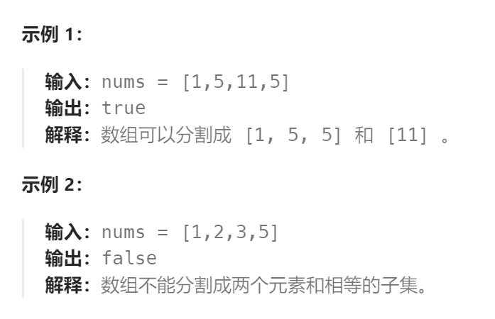

题目：

给你一个 **只包含正整数** 的 **非空** 数组 `nums` 。请你判断是否可以将这个数组分割成两个子集，使得两个子集的元素和相等。



题解：

这道题目是要找是否可以将这个数组分割成两个子集，使得两个子集的元素和相等。

那么只要找到集合里能够出现 sum / 2 的子集总和，就算是可以分割成两个相同元素和子集了。

先求出`nums[]`数组的数组和 sum，然后计算从 `nums[]` 选取若干数，看能否组成 `sum/2`，从而将这个问题转化为`01背包问题`。

- 背包的体积为sum / 2
- 背包要放入的商品（集合里的元素）**重量为 元素的数值**，**价值也为元素的数值**
- 背包如果正好装满，说明找到了总和为 sum / 2 的子集。
- 背包中每一个元素是不可重复放入。

此题将`sum/2`作为`dp[i]`的索引`i`，因此`sum/2`必须保证为正整数，也就是`sum`必须为偶数。

### 思路一：

`dp[i]` 表示：容量为i的背包，能否用`nums[]`中的元素刚好凑出，凑出为true，凑不出为false。

```go
func canPartition(nums []int) bool {
    sum := 0
    for i:= range nums {
        sum += nums[i]
    }
    if sum % 2 == 1{
        return false
    }
    // dp[i]表示: 是否可以从nums[]中凑齐 sum/2, 必须确保 sum/2 为整数(也就是说 sum 必须是偶数)，因为下标不能为小数
    dp := make([]bool, sum/2 + 1)    
    for i := range dp {   // 初始化应该全部设置为 false
        dp[i] = false
    }  
    // base case: 如果目标和 j == nums[i], 那么可以凑出,此时的 dp[j - nums[i]] = dp[0] 应该设置为true
    dp[0] = true

    for i := 0; i < len(nums); i++ {   // 先遍历可选择的数(正序)
        for j := sum/2; j >= nums[i]; j-- {   // 再遍历目标和(倒序，因为每个可选择的数只能用一次)
            dp[j] = dp[j] || dp[j - nums[i]]
        }
    }
    return dp[sum/2]
}
```

### 思路二：

`dp[i]` 表示：**容量为i**的背包，所背的**物品的最大价值**。

1. 确定递推公式

01背包的递推公式为：`dp[j] = max(dp[j], dp[j - weight[i]] + value[i]);`

本题，相当于背包里放入数值，那么**物品i的重量是`nums[i]`**，其**价值也是`nums[i]`**。

所以递推公式：`dp[j] = max(dp[j], dp[j - nums[i]] + nums[i]);`

2. `dp`数组如何初始化

从`dp[i]`的定义来看，首先`dp[0]`一定是0。

如果如果题目给的价值都是正整数那么非0下标都初始化为0就可以了，如果题目给的价值有负数，那么非0下标就要初始化为负无穷。

**这样才能让`dp`数组在递归公式的过程中取的最大的价值，而不是被初始值覆盖了**。

代码如下：

```go
// 背包的容量是 sum/2
dp := make([]int, sum/2 + 1)
```

3. 确定遍历顺序

如果使用一维`dp`数组，**物品遍历**的for循环**放在外层**，**遍历背包**的for循环**放在内层**，且**内层for循环倒序遍历**！

```go
// 开始 01背包 
for(int i = 0; i < nums.size(); i++) {
    for(int j = sum/2; j >= nums[i]; j--) { // 每一个元素一定是不可重复放入，所以从大到小遍历
        dp[j] = max(dp[j], dp[j - nums[i]] + nums[i]);
    }
}
```

4. 举例推导`dp`数组

`dp[i]`的数值一定是小于等于i的。

**如果`dp[i] == i` 说明，集合中的子集总和正好可以凑成总和i**。

如果最终有：`dp[sum/2] = sum/2`，那么说明 `nums[]`中存在一个子集可以凑出`sum/2`，则剩余的数字凑齐另外的`sum/2`。

用例1，输入[1,5,11,5] 为例，如图：


最后`dp[11] == 11`，说明可以将这个数组分割成两个子集，使得两个子集的元素和相等。

5. 完整代码

```go
func canPartition(nums []int) bool {
    sum := 0
    for i:= range nums {
        sum += nums[i]
    }
    if sum % 2 == 1{
        return false
    }
    // dp[i]表示: 容量为i的背包，所背的物品的最大价值。
    dp := make([]int, sum/2 + 1)   // sum/2 必须为正整数，因此sum必须是偶数
    // 最大容量为0的背包，能存储的最大价值也是0
    dp[0] = 0

    for i := 0; i < len(nums); i++ {
        for j := sum/2; j >= nums[i]; j-- {
            dp[j] = getMax(dp[j], dp[j - nums[i]] + nums[i])
        }
    }
    if dp[sum/2] == sum/2 {  // 容量为 sum/2 的背包，最大的价值也是 sum/2 时，则表面可以凑出
        return true
    } else {
        return false
    }
}

func getMax(a, b int) int {
    if a > b {
        return a 
    } else {
        return b
    }
}
```

