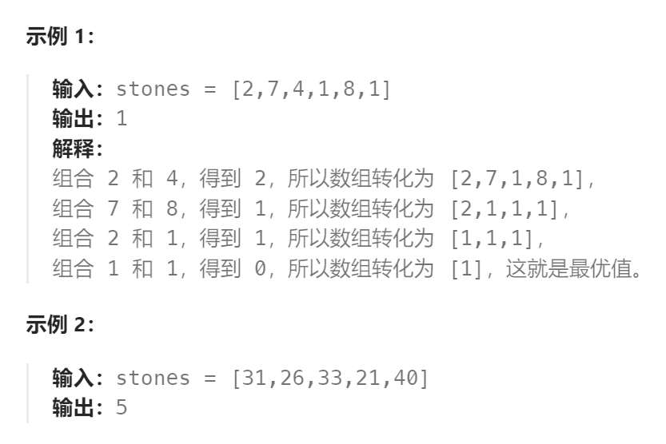

题目：

有一堆石头，用整数数组 `stones` 表示。其中 `stones[i]` 表示第 `i` 块石头的重量。

每一回合，从中选出**任意两块石头**，然后将它们一起粉碎。假设石头的重量分别为 `x` 和 `y`，且 `x <= y`。那么粉碎的可能结果如下：

- 如果 `x == y`，那么两块石头都会被完全粉碎；
- 如果 `x != y`，那么重量为 `x` 的石头将会完全粉碎，而重量为 `y` 的石头新重量为 `y-x`。

最后，**最多只会剩下一块** 石头。返回此石头 **最小的可能重量** 。如果没有石头剩下，就返回 `0`。




题解：

思路：本题其实就是**尽量**让石头分成**重量相同的两堆**，相撞之后剩下的石头最小，**这样就化解成01背包问题了**。

```go
func lastStoneWeightII(stones []int) int {
    sum := 0
    for i:= range stones {
        sum += stones[i]
    }
    // dp[i]表示: 容量为i的背包，所背的石头的最大重量（这里的重量就是价值）。
    dp := make([]int, sum/2 + 1)   // sum/2 向下取整
    // base case: 容量是0，最大重量只能是0
    dp[0] = 0

    for i := 0; i < len(stones); i++ {   // 先正序遍历物品
        for j := sum/2; j >= stones[i]; j-- {	// 再逆序遍历背包容量
            dp[j] = getMax(dp[j], dp[j - stones[i]] + stones[i])
        }
    }
    // 最后 dp[sum/2] 里是容量为 sum/2 的背包所能背的最大重量。
    // 那么分成两堆石头，一堆石头的总重量是 dp[sum/2] ，另一堆就是 sum - dp[sum/2]
    // 在计算target的时候，sum / 2 因为是向下取整，所以sum - dp[sum/2] 一定是大于等于dp[sum/2]的。
    // 那么相撞之后剩下的最小石头重量就是 (sum - dp[sum/2]) - dp[sum/2]。
    return sum - dp[sum/2] - dp[sum/2]
}

func getMax(a, b int) int {
    if a > b {
        return a 
    } else {
        return b
    }
}
```

