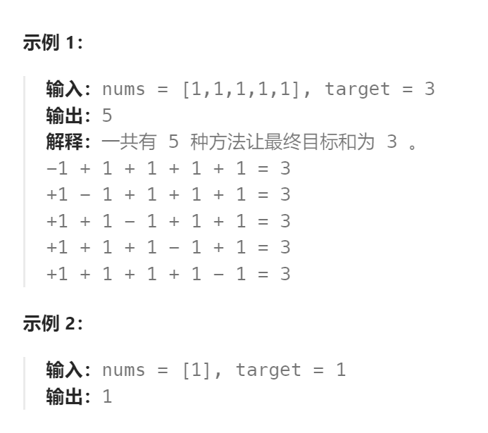

题目：

给你一个非负整数数组 `nums` 和一个整数 `target` 。

向数组中的每个整数前添加 `'+'` 或 `'-'` ，然后串联起所有整数，可以构造一个 **表达式** ：

- 例如，`nums = [2, 1]` ，可以在 `2` 之前添加 `'+'` ，在 `1` 之前添加 `'-'` ，然后串联起来得到表达式 `"+2-1"` 。

返回可以通过上述方法构造的、运算结果等于 `target` 的不同 **表达式** 的数目。



题解：

#### 如何转换为0-1背包问题？

本题的目标是利用 `nums[]`中所有的数字，仅通过加法和减法运算来到达`target`。因为只允许使用加法和减法，因此一定有：

- `target == left_sum - right_sum` (left_sum 和 right_sum 分别是 `nums[]` 子集之和(只有加法,没有减法))
- `left_sum + right_sum = sum` (sum 是 `nums[]` 中所有元素之和)

因此问题可以转换为求：`nums[]`中是否存在符合上述关系的 `left_sum `和`right_sum` ：

进一步计算，可知： 

- `left_sum = target + right_sum = target + sum - left_sum`

- `left_sum = (target + sum) / 2`

因此本题的目标就是查询 `nums[]` 中是否存在子集直接通过加法运算获得 `left_sum`。这样问题就变成了一个01背包问题( 每个 `nums[i]` 只能使用一次)

```go
func findTargetSumWays(nums []int, target int) int {
    // target == left_sum - right_sum， left_sum 和 right_sum 分别是 nums[] 子集之和(只有加法,没有减法)
    // left_sum + right_sum = sum
    // sum 是 nums[] 中所有元素之和
    // left_sum = target + right_sum = target + sum - left_sum
    // left_sum = (target + sum) / 2, 因此本题的目标就是查询 nums[] 中是否存在子集直接组成 left_sum
    sum := 0
    for i := range nums {
        sum += nums[i]
    }
    // left_sum - right_sum 的取值范围是 [-sum, sum], 能够实现的 target 必须在这个范围内
    if getAbs(target) > sum {  
        return 0
    }
    if (sum + target) % 2 == 1 {  // 必须保证 left_sum 是正整数
        return 0
    }
    left_sum := (sum + target) / 2
    // dp[i]表示: 在nums[]中选择任意个数，能够恰好组成和为 i 的表达式的个数
    dp := make([]int, left_sum + 1)
    dp[0] = 1  // 组成和为0, 只有一种方法, 那就是一个数字也不选择

    // 0-1背包，一维dp，必须先正序遍历物品，然后再逆序遍历背包
    for i := 0; i < len(nums); i++ {
        for j := left_sum; j >= nums[i]; j-- {
            dp[j] += dp[j - nums[i]]   // += 可以获取组成j的全部组合
        }
    }
    return dp[left_sum]
}
```

