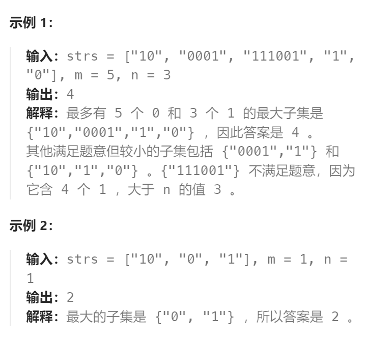

题目：

给你一个二进制字符串数组 `strs` 和两个整数 `m` 和 `n` 。

请你找出并返回 `strs` 的**最大子集**的**长度**，该子集中 **最多** 有 `m` 个 `0` 和 `n` 个 `1` 。

如果 `x` 的所有元素也是 `y` 的元素，集合 `x` 是集合 `y` 的 **子集** 。



题解：

**这其实是一个`0-1背包`问题，只不过对应的每一个背包有两个状态：0的个数 和 1的个数**。

这里的背包就是一个子集。

**一个背包的重量**在这里不是由一个单独的数值来衡量，而是由子集中0的个数和1的个数一起来衡量。

**一个背包的价值**就是这个子集中元素的个数。

```go
func findMaxForm(strs []string, m int, n int) int {
    // dp[i][j]表示: 子集最多有m个0、n个1时，子集的最大长度
    dp := make([][]int, m+1)
    for i := range dp {
        dp[i] = make([]int, n+1)
    }
    // 0个0, 0个1, 符合这样的只有空子集，空子集的长度就是0
    dp[0][0] = 0

    // 0-1背包，只不过每个物品有两个维度，分别是0的个数和1的个数
    // 先正序循环物品(也就是字符串)，再逆序循环背包(也就是子集长度，子集的长度由0和1的个数所决定)
    for _, str := range strs {
        zeroNum := 0    // 统计当前字符串中0的个数
        oneNum := 0     // 统计当前字符串中1的个数
        for _, char := range str {
            if char == '0' {
                zeroNum++
            } else {
                oneNum++
            }
        }
        // 物品的两个维度，都需要从大到小遍历，但至于先遍历哪一个维度时无所谓的
        // 这里分别用 i,j 表示子集中 0的个数 和 1的个数
        for i := m; i >= zeroNum; i-- {
            for j := n; j >= oneNum; j-- {
                dp[i][j] = getMax(dp[i][j], dp[i-zeroNum][j-oneNum] + 1)
            }
        }
    }
    return dp[m][n]
}
func getMax(a,b int) int {
    if a > b {
        return a
    } else {
        return b
    }
}
```

