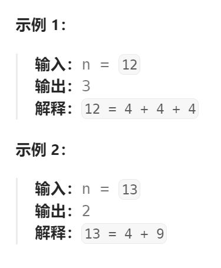

题目：

给你一个整数 `n` ，返回 *和为 `n` 的完全平方数的最少数量* 。

**完全平方数** 是一个整数，其值等于另一个整数的平方；换句话说，其值等于一个整数自乘的积。例如，`1`、`4`、`9` 和 `16` 都是完全平方数，而 `3` 和 `11` 不是。



题解：

### 方法一：完全背包问题解法

- 可选择的货物：就是 1^2，2^2, ……，sqrt(n)^2 这些不超过n的完全平方数
- 背包容量：就是n

需要注意的几点：

- 因为此题对于 `dp[i][j]`的设置，是选择数量最少作为最优值，因此非法的状态(也就是无法通过任何完全平方数组成的n)必须设置为`math.MaxInt`，否则会对 `dp[i][j] = getMin(dp[i-1][j], dp[i][j- i*i] + 1) `的设置造成干扰。如果非要把非法的状态设置为0，那么在完成对`dp[i][j]`的设置之前，必须分情况讨论，如下面的注释一样的操作。
- 对于` j - i*i == 0`这种情况，必须单独将其设置为`dp[i][j] = 1`。可以将其视为是 base case的一种情况。否则会导致：

​		`dp[1*1][1] = dp[0][1] + 1 = 1+1 = 2`，多加了一个1。

```go
func numSquares(n int) int {
    // 用背包问题解决，那么可选择的货物就是 1~sqrt(n), 背包的空间就是 n 
    scope := int(math.Sqrt(float64(n)))
    // dp[i][j]表示: 从 1~i 范围内选数，组成 n 时需要的完全平方数的最少数量
    dp := make([][]int, scope + 1)   // scope == 0 不使用
    for i := range dp {
        dp[i] = make([]int, n+1)  
    }
    // base case: j == 0, 只有0可以组成0，其他数都不可能组成0
    dp[0][0] = 1
    for i := 1; i <= scope; i++ {
        dp[i][0] = 0
    }
    // base case: i == 1(因为1这个完全平方数可以无限制使用，因此从前往后遍历)
    for j := 1; j <= n; j++ {
        dp[1][j] = dp[1][j- 1] + 1
    }

    for i := 2; i <= scope; i++ {   // 因为 i == 1已经被算出来了，所有从 i == 2开始
        for j := 1; j <= n; j++ {
            if j - i*i == 0 {   // 凑齐j，刚好就只需要 i*i 这一个完全平方数
                dp[i][j] = 1
            } else if j - i*i < 0 {  // 超额，只能选择不使用当前末尾的i
                dp[i][j] = dp[i-1][j]   
            } else {  // 可以选择使用或者不使用当前末尾的i, 但是选择需要完全平方数数量最少的那一个
                dp[i][j] = getMin(dp[i-1][j], dp[i][j- i*i] + 1) 
            }
        }
    }
    return dp[scope][n]
}

func getMin(a, b int) int {
    if a < b {
        return a
    } else {
        return b
    }
}
```


### 方法二：状态压缩（滚动数组）

```go
func numSquares(n int) int {
    // dp[j]：组成目标整数 j 需要使用的完全平方数的最少数量
    dp := make([]int, n+1)  
    dp[0] = 0  // 因为可用的完全平方数最小只能从1开始，因此对于目标整数为0，无法凑出
    // 因为 dp[j] 每次需要选择最小数量，因此初始化时都需要设置成 n + 1（全部用1去拼凑也仅需要n个），这样就不会造成干扰
    for j := 1; j <= n; j++ {
        dp[j] = n + 1  // 最好不用 math.MaxInt, 因为有时候可能会溢出
    }
    // 先物品还是先背包无所谓，这里用的是先物品后背包
    for i := 1; i*i <= n; i++ {     // 先遍历可用的完全平方数(可用的完全平方数有: 1, 4, 9,……,sqrt(n)^2)
        for j := i*i; j <= n; j++ {   // 完全背包问题，因为每个完全平方数可以重复使用，因此正序
            dp[j] = getMin(dp[j], dp[j - i*i] + 1)
        }
    }
    return dp[n]
}

func getMin(a, b int) int {
    if a < b {
        return a
    } else {
        return b
    }
}
```

