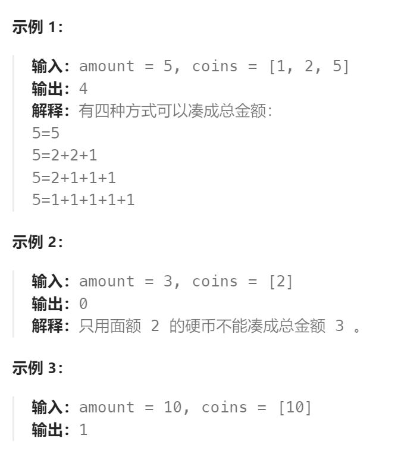

题目：

给你一个整数数组 `coins` 表示不同面额的硬币，另给一个整数 `amount` 表示总金额。

请你计算并返回可以凑成总金额的硬币组合数。如果任何硬币组合都无法凑出总金额，返回 `0` 。

假设每一种面额的硬币有无限个。 

题目数据保证结果符合 32 位带符号整数。



题解：

### 方法一：完全背包问题

```go
func change(amount int, coins []int) int {
    // dp[i][j]的含义: 用前i个硬币，凑成数额为j时，总共可行的硬币组合数
    dp := make([][]int, len(coins))
    for i := range dp {
        dp[i] = make([]int, amount + 1)
    }
    // base case
    dp[0][0] = 1
    // base case: j == 0时, 无论用什么硬币组合都可以凑出
    for i := 1; i < len(coins); i++ {
        dp[i][0] = 1
    }
    // base case: i == 0时, 只有第0枚硬币，去凑成数额j(因为硬币可以无限制使用，因此采用正序遍历)
    for j := coins[0]; j <= amount; j++ {
        dp[0][j] = dp[0][j - coins[0]]  // 其实全都是1，因为仅用一种货币去凑，组合数肯定只有1种
    }
    // 对于二维DP来说，先遍历物品还是先遍历背包都是无所谓的，只要dp[0][j]这一行按照对应正(逆)序设置对即可
    for i := 1; i < len(coins); i++ {
        for j := 1; j <= amount; j++ {
            if j - coins[i] < 0 {   // 一旦选择coins[i-1]这枚硬币，就超出了总数额为j的上限
                // 对于 0~i-1这前i个硬币，只能选择不使用coins[i-1]这枚硬币去凑成j数额
                dp[i][j] = dp[i-1][j]  
            } else {
                // 对于 0~i-1这前i个硬币，可以选择使用或者不使用coins[i-1]这枚硬币去凑成j数额
                dp[i][j] = dp[i-1][j] + dp[i][j - coins[i]]
            }
        }
    }
    // 想要的结果：用前len(coins)个硬币，去凑成amount数额
    return dp[len(coins)-1][amount]
}
```

### 方法二：滚动数组

去掉 i 这个维度，投影到 j 这个维度。

```go
func change(amount int, coins []int) int {
    // dp[i]表示: 金额为i时，用硬币凑成的组合数
    dp := make([]int, amount + 1)
    dp[0] = 1

    // 一维dp(滚动数组)，要的是组合，因此必须先遍历硬币(物品)。再遍历金额(背包)
    for i := 0; i < len(coins); i++ {   
        for j := coins[i]; j <= amount; j++ {	 // 然后再遍历金额(背包),因为硬币数量无限制，因此需要从小到大遍历
            dp[j] = dp[j] + dp[j - coins[i]]
        }
    }
    return dp[amount]
}
```

