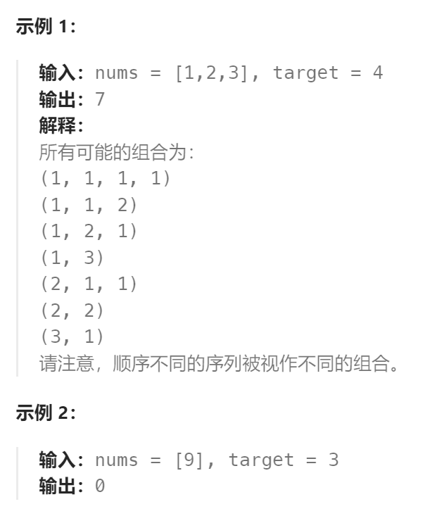

题目：

给你一个由 **不同** 整数组成的数组 `nums` ，和一个目标整数 `target` 。请你从 `nums` 中找出并返回总和为 `target` 的元素组合的个数。

题目数据保证答案符合 32 位整数范围。



题解：

此题与`零钱兑换II`的唯一区别就是：前者是一个组合问题，而这个题是一个排列问题。

也即使说：`[1,1,2]`和`[1,2,1]`这样除了顺序不同其他都一致的一个组合，在`零钱兑换II`中认为是一种答案，但是在这个题目中认为是两种不同的答案。

解决方法也很简单，在`零钱兑换II`中，求解`dp[i]`（只有**状态压缩的解法**这样做行得通）的时候，我们的两层`for`循环规定的是：**外层`for`循环针对硬币(物品)，内层`for`循环针对目标金额(背包)。这样的方式求解出来的就是组合。**

但如果：**外层`for`循环针对目标金额(背包)，内层`for`循环针对硬币(物品)。这样的方式求解出来的就是排列。**

因此，此题解法：

```go
func combinationSum4(nums []int, target int) int {
    dp := make([]int, target + 1)
    dp[0] = 1

    // 先遍历物品，再遍历背包得到的就是所有的组合
    // 但如果先遍历背包，再遍历物品，得到的就是所有的排列(排列中，只有元素顺序不同的组合视为不同的答案)
    // 此题目要的是排列，因此先遍历背包，再遍历物品
    for j := 1; j <= target; j++ {   
        for i := 0; i < len(nums); i++ {
            if j - nums[i] >= 0 {
                dp[j] = dp[j] + dp[j-nums[i]]
            }
        }
    }
    return dp[target]
}
```

