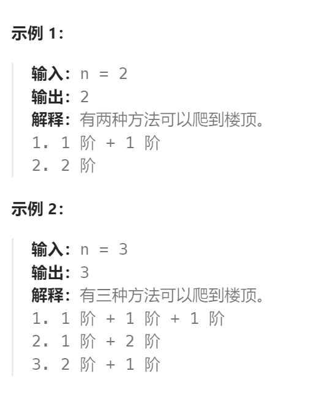

题目：

原始的爬楼梯问题，如下：

假设你正在爬楼梯。需要 `n` 阶你才能到达楼顶。

每次你可以爬 `1` 或 `2` 个台阶。你有多少种不同的方法可以爬到楼顶呢？



如上所示，原始题目中每次仅仅可以选择爬1阶或者2阶。

改进版：每次可以爬**1 、 2、……、m 个台阶**，问：总共有多少种方式可以爬到楼顶？


题解：

此题经过上面的改进，变成了一个完全背包问题。而且虽然**1、2 步  和 2、1 步都是上三个台阶，但是这两种方法不一样！**因此这还是一个**求排列的完全背包问题。**

```go
func climbStairs(n int, m int) int {
    dp := make([]int, n+1)  
	dp[0] = 1
	// 排列问题，需要先背包后物品。而且因为是完全背包，因此背包要从小到大
    for i := 1; i <= n; i++ {
        for j := 1; j <= m; j++ {   // 每次可以选择爬1、 2、 ……、m个台阶
            if i >= j {
            	dp[i] += dp[i-j]   // 从这里可以看出，dp[0]必须是1，否则所有的dp[i]都等于0    
            }
        }
    }
    return dp[n]
}
```

上述题解，把 m 改成 2 就是 `70.爬楼梯` 的解法。