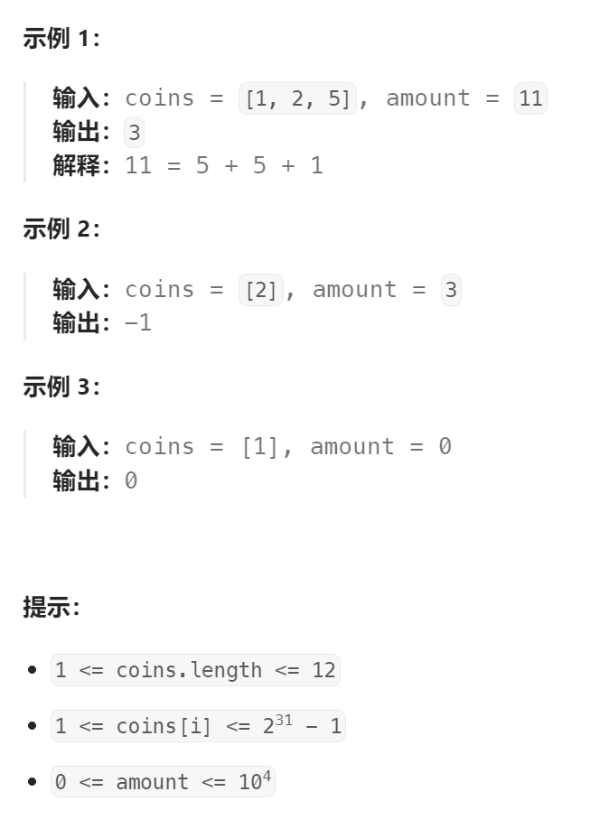

题目：

给你一个整数数组 `coins` ，表示不同面额的硬币；以及一个整数 `amount` ，表示总金额。

计算并返回可以凑成总金额所需的 **最少的硬币个数** 。如果没有任何一种硬币组合能组成总金额，返回 `-1` 。

你可以认为每种硬币的数量是无限的。



题解：

这很明显是一道`完全背包`问题。因此在 `for` 循环遍历背包的时候，需要正序，因为每一个物品(硬币)都可以重复使用。

而且因为求得是最少硬币数，而不是组合/排列个数，因此：先物品再背包，还是先背包再物品都是一样的。

唯一需要关注的一点是：初始条件的设置。

- `dp[0] = 0`，因为凑齐数额为0，不需要任何硬币
- 其他 `dp[i]` ，都需要**设置为一个较大值**，这样才不会干扰`dp[j] = getMin(dp[j], dp[j - coins[i]] + 1)`每次取更小值。（**如果初始设置为0，`dp[j]`就会一直取0**）。至于这个较大值，设置为多少？**这里设置为`amount + 1`即可，如果全部都用硬币1去凑amount，最多也仅需要 amount 个硬币，不会存在比这硬币数还多的情况。**

```go
func coinChange(coins []int, amount int) int {
    // dp[i]表示： 凑齐数额为 i 的最少硬币个数
    dp := make([]int, amount + 1)
    dp[0] = 0  // 凑齐数额为0，不需要任何硬币
    // 因为要求最少硬币数，所有初始时所有的dp[i]设置为 amount + 1 (如果全部都用硬币1去凑，最多也仅需要 amount 个)
    for i := 1; i <= amount; i++ {
        dp[i] = amount + 1
    }
    // 完全背包问题，不是组合排列问题，因此先背包还是先物品无所谓
    // 这里用的是：先物品，后背包
    for i := 0; i < len(coins); i++ {
        for j := 1; j <= amount; j++ {  // 完全背包，物品可重复使用，因此正序
            if j - coins[i] >= 0 {
                dp[j] = getMin(dp[j], dp[j - coins[i]] + 1)
            }
        } 
    }
    if dp[amount] > amount {
        return -1
    } else {
        return dp[amount]
    }
}
func getMin(a, b int) int {
    if a < b {
        return a
    } else {
        return b
    }
}
```

