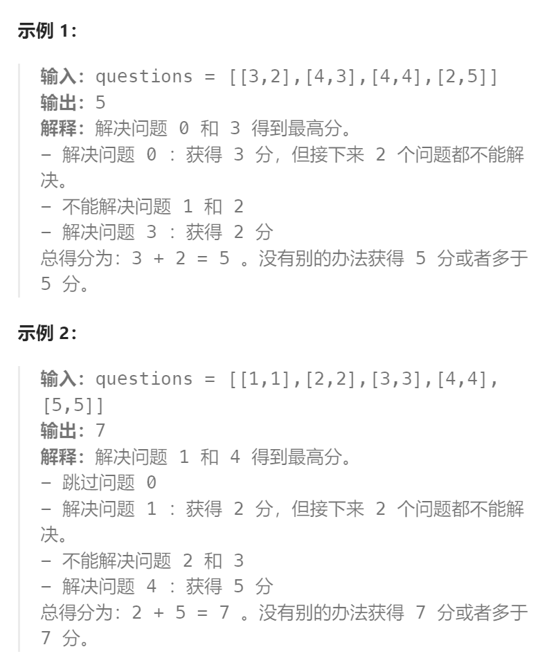

题目：

给你一个下标从 **0** 开始的二维整数数组 `questions` ，其中 `questions[i] = [pointsi, brainpoweri]` 。

这个数组表示一场考试里的一系列题目，你需要 **按顺序** （也就是从问题 `0` 开始依次解决），针对每个问题选择 **解决** 或者 **跳过** 操作。解决问题 `i` 将让你 **获得** `pointsi` 的分数，但是你将 **无法** 解决接下来的 `brainpoweri` 个问题（即只能跳过接下来的 `brainpoweri` 个问题）。如果你跳过问题 `i` ，你可以对下一个问题决定使用哪种操作。

- 比方说，给你 questions = [[3, 2], [4, 3], [4, 4], [2, 5]]：
  - 如果问题 `0` 被解决了， 那么你可以获得 `3` 分，但你不能解决问题 `1` 和 `2` 。
  - 如果你跳过问题 `0` ，且解决问题 `1` ，你将获得 `4` 分但是不能解决问题 `2` 和 `3` 。

请你返回这场考试里你能获得的 **最高** 分数。



题解：

### 方法一：逆向DP(优先选择)

我们可以从**无后效性**的角度考虑动态规划「状态」的定义。**对于每一道题目，解决与否会影响到后面一定数量题目的结果，但不会影响到前面题目的解决**。因此我们可以**考虑从反方向定义「状态」**，即**考虑解决每道题本身及以后的题目可以获得的最高分数。**

```go
func mostPoints(questions [][]int) int64 {
    n := len(questions)
    // dp[i]表示: 从第i个题目开始，到结尾 可以获得的最高分数
    dp := make([]int64, n + 1)
    dp[n] = 0   // 没有任何题目可选，因此得分为0

    for i := n-1; i >= 0; i-- {
        // 表示不选择这第i个题目，能获得的最高分数
        way1 := dp[i+1]  
        // 表示选择这第i个题目，能获得的最高分数
        // 如果选择了这第i个题目，下一次就只能从第 i + questions[i][1] + 1 道题目开始选择，而且题目编号不能超过n
        way2 := int64(questions[i][0]) + dp[getMin(n, i + questions[i][1] + 1)]
        dp[i] = getMax(way1, way2)
    }

    return (dp[0]) 
}

func getMax(a, b int64) int64 {
    if a > b {
        return a
    } else {
        return b
    }
}

func getMin(a, b int) int {
    if a < b {
        return a
    } else {
        return b
    }
}
```

### 方法二：正向DP

```go
func mostPoints(questions [][]int) int64 {
    var n int = len(questions)
    // dp[i]表示: 以第i道题作为结尾(从 0~i 中选择题目时)可以获得的最高分数
    var dp []int64 = make([]int64, n + 1)
    for i := 0; i < n; i ++ {
        var point int64 = int64(questions[i][0])
        var brainpower int = int(questions[i][1])

        //---- 跳过i(那么直接影响的就是 dp[i+1] )
        dp[i + 1] = max(dp[i], dp[i + 1])
        //---- 不跳过i(那么直接影响的就是 dp[i + questions[i][1] + 1])
        var j int = min(i + brainpower + 1, n)
        dp[j] = max(dp[i] + point, dp[j])
    }

    return dp[n]
}


func min(a int, b int) (int) {
    if a < b {
        return a
    }
    return b
}

func max(a int64, b int64) (int64) {
    if a > b {
        return a
    }
    return b
}
```

