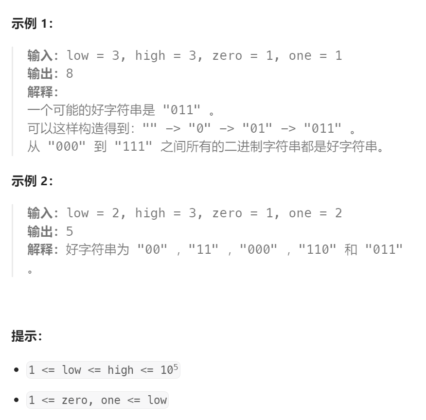

题目：

给你整数 `zero` ，`one` ，`low` 和 `high` ，我们从空字符串开始构造一个字符串，每一步执行下面操作中的一种：

- 将 `'0'` 在字符串末尾添加 `zero` 次。
- 将 `'1'` 在字符串末尾添加 `one` 次。

以上操作可以执行任意次。

如果通过以上过程得到一个 **长度** 在 `low` 和 `high` 之间（包含上下边界）的字符串，那么这个字符串我们称为 **好** 字符串。

请你返回满足以上要求的 **不同** 好字符串数目。由于答案可能很大，请将结果对 `109 + 7` **取余** 后返回。



题解：

这其实是就是一个`爬楼梯`问题的改进版，只要把那道题的 `爬1阶` 和 `爬2阶` 替换成 `追加zero个0` 和 `追加one个1` 就是了，爬楼梯变成追加字符串。

因此这个题完全可以用**完全背包**解决。只不过**作为背包的上限容量有多个**：从`low`到`high`，需要最后把`dp[low]`，……，`dp[high]`的所有可能都加起来。

```go
func countGoodStrings(low int, high int, zero int, one int) int {
    // dp[i]表示: 长度为 i 的好字符串最大个数(可以按照规则拼出的长度为i的字符串个数)
    dp := make([]int, high+1)   
    // 完全背包问题：背包就是字符串长度i，物品就是 两种操作。而且求得是排列问题(01和10是不同的字符串)
    dp[0] = 1   
    for j := 1; j <= high; j++ {   // 正序枚举背包，因为物品可以重复使用
        for i := 0; i <= 1; i++ {   // 一共两种物品选择，要么追加0，要么追加1
            addLen := 0
            if i == 0 {   // 追加0
                addLen = zero
            } else {   // 追加1
                addLen = one
            }
            if j - addLen >= 0 {
                dp[j] += (dp[j - addLen] % 1000000007)   // 需要注意的地方，因此数值过大，因此每次都需要重新取余数
            }
        }
    }
    // 返回所有好字符串的个数
    sum := 0
    for i := low; i <= high; i++ {
        sum += dp[i]
    }
    return sum % 1000000007
}
```

