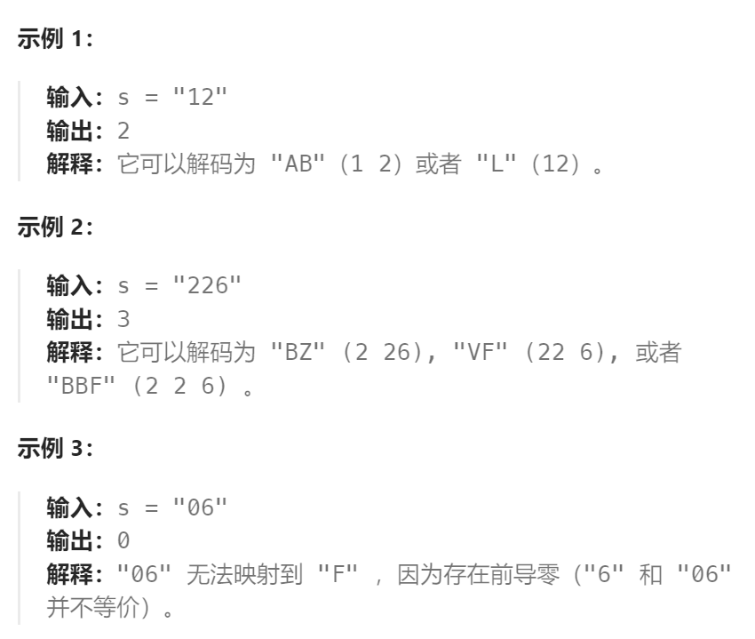

题目：

一条包含字母 `A-Z` 的消息通过以下映射进行了 **编码** ：

```
'A' -> "1"
'B' -> "2"
...
'Z' -> "26"
```

要 **解码** 已编码的消息，所有数字必须基于上述映射的方法，反向映射回字母（可能有多种方法）。例如，`"11106"` 可以映射为：

- `"AAJF"` ，将消息分组为 `(1 1 10 6)`
- `"KJF"` ，将消息分组为 `(11 10 6)`

注意，消息不能分组为 `(1 11 06)` ，因为 `"06"` 不能映射为 `"F"` ，这是由于 `"6"` 和 `"06"` 在映射中并不等价。

给你一个只含数字的 **非空** 字符串 `s` ，请计算并返回 **解码** 方法的 **总数** 。

题目数据保证答案肯定是一个 **32 位** 的整数。



题解：

常规的`动态规划处理字符串`问题。

```go
func numDecodings(s string) int {
    n := len(s)
    // dp[i]表示: s的前[0:i]个字符组成的子串，解码方法的总数
    dp := make([]int, n + 1)
    dp[0] = 1
    // 解码表
    decodeMap := make(map[string]bool)
    for i := 1; i <= 26; i++ {
        decodeMap[strconv.Itoa(i)] = true
    }
    // 枚举子串 s[0:end]
    for end := 1; end <= n; end++ {
        // 枚举 s[0:end] = s[0:lastEnd] + s[lastEnd:end]
        for lastEnd := 0; lastEnd < end; lastEnd++ {
            char := s[lastEnd:end]   // 新追加的解码字符 s[lastEnd:end]
            if decodeMap[char] {   // 新字符 s[lastEnd:end] 存在于解码表
                dp[end] += dp[lastEnd]  // s[0:end] 的解码方法就等于 s[0:lastEnd] 的解码方法
            }
            // 新字符 s[lastEnd:end] 存在于解码表，说明该解码方式无效
        }
    }

    return dp[n]
}
```

