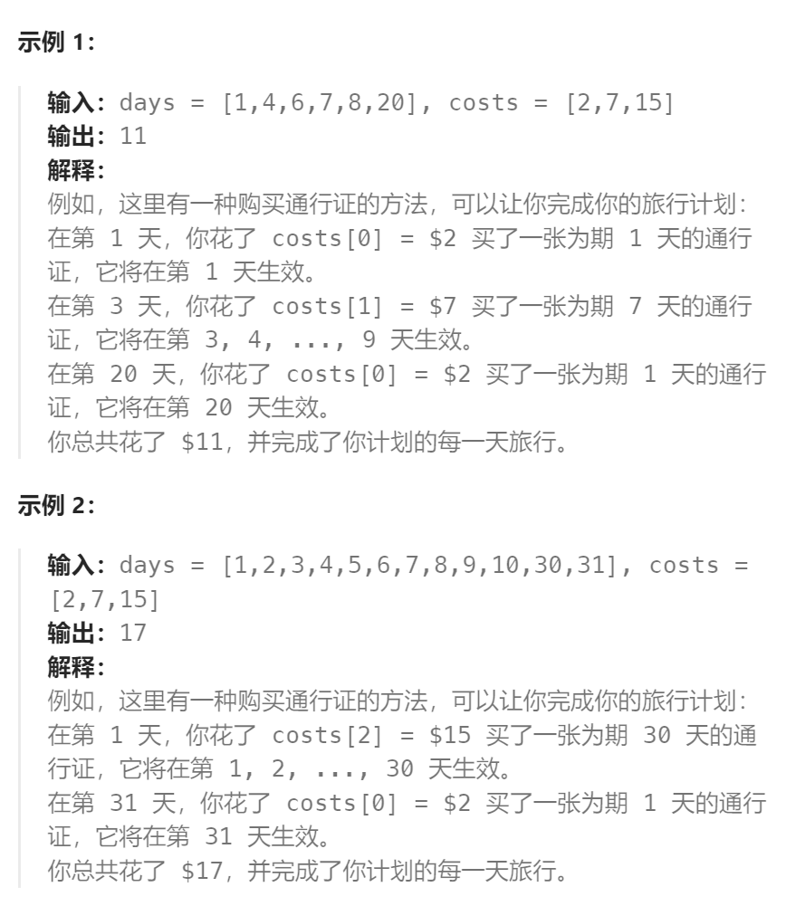

题目：

在一个火车旅行很受欢迎的国度，你提前一年计划了一些火车旅行。在接下来的一年里，你要旅行的日子将以一个名为 `days` 的数组给出。每一项是一个从 `1` 到 `365` 的整数。

火车票有 **三种不同的销售方式** ：

- 一张 **为期一天** 的通行证售价为 `costs[0]` 美元；
- 一张 **为期七天** 的通行证售价为 `costs[1]` 美元；
- 一张 **为期三十天** 的通行证售价为 `costs[2]` 美元。

通行证允许数天无限制的旅行。 例如，如果我们在第 `2` 天获得一张 **为期 7 天** 的通行证，那么我们可以连着旅行 7 天：第 `2` 天、第 `3` 天、第 `4` 天、第 `5` 天、第 `6` 天、第 `7` 天和第 `8` 天。

返回 *你想要完成在给定的列表 `days` 中列出的每一天的旅行所需要的最低消费* 。



题解：

思路：此题和`解决智商问题`的解决思路完全一致，这里我们采用逆序`dp`的方式:

```go
func mincostTickets(days []int, costs []int) int {
    traveMap := make(map[int]bool)  // 记录要出去旅行的日子
    for _, day := range days {
        traveMap[day] = true
    }
    // dp[i]: 在第i天开始，到本年的最后一天结束时，需要的最低消费
    dp := make([]int, 365 + 2)  // 0 ~ 366
    dp[366] = 0  // 不会再旅行了，因此不会花费任何费用

    for i := 365; i >= 1; i-- {
        if !traveMap[i] {  // 今天不需要去旅行
            way1 := dp[i+1]  // 今天不买票
            way2 := costs[1] + dp[getMin(366, i+7)]  // 今天买一张7天可用的票(注意日子不能溢出)
            way3 := costs[2] + dp[getMin(366, i+30)] // 今天买一只30天可用的票
            dp[i] = getMin(way1, getMin(way2, way3))
        } else {  // 今天需要旅行(今天一定要有通行证)
            way1 := costs[0] + dp[i+1]   // 今天买一张1天可用的票
            way2 := costs[1] + dp[getMin(366, i+7)]  // 今天买一张7天可用的票
            way3 := costs[2] + dp[getMin(366, i+30)] // 今天买一只30天可用的票
            dp[i] = getMin(way1, getMin(way2, way3))
        }
    }
    // 旅行最少从第1天开始
    return dp[1]
}
func getMin(a, b int) int {
    if a < b {
        return a
    } else {
        return b
    }
}
```

