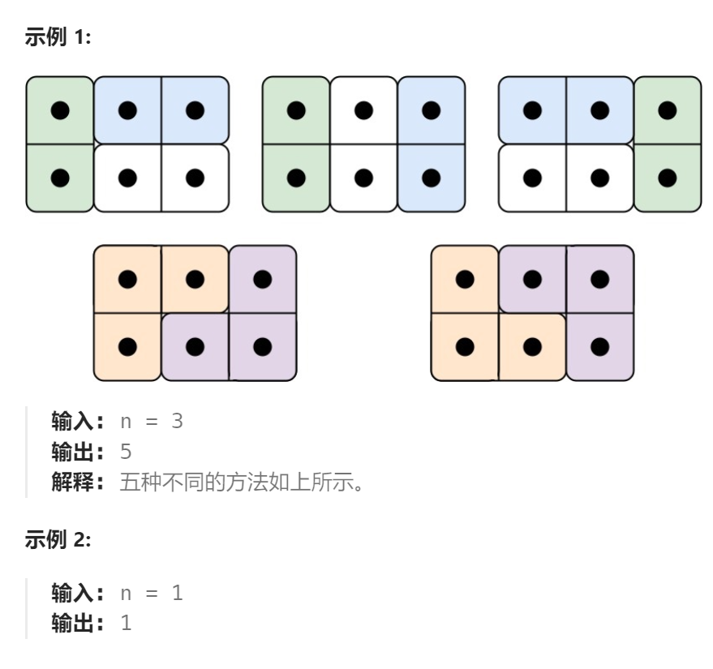
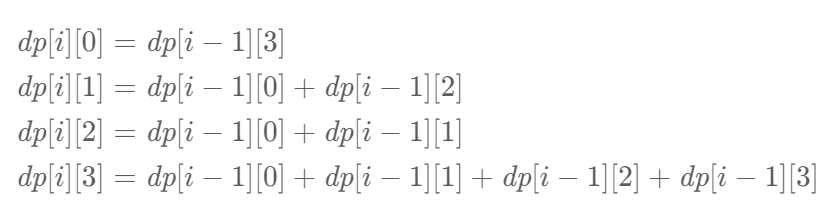

题目：

有两种形状的瓷砖：一种是 `2 x 1` 的多米诺形，另一种是形如 "L" 的托米诺形。两种形状都可以旋转。


给定整数 n ，返回可以平铺 `2 x n` 的面板的方法的数量。**返回对** `109 + 7` **取模** 的值。

平铺指的是每个正方形都必须有瓷砖覆盖。两个平铺不同，当且仅当面板上有四个方向上的相邻单元中的两个，使得恰好有一个平铺有一个瓷砖占据两个正方形。



题解：

这个题的解题思路，与**股票问题**一致，也是使用了**状态机**。

考虑这么一种平铺的方式：在**第  i  列前面的正方形都被瓷砖覆盖**，在**第 i 列后面的正方形都没有被瓷砖覆盖**（i 从 1 开始计数）。那么**第 i 列的正方形有四种被覆盖的情况**：

- 一个正方形都没有被覆盖，记为状态 0 ；

- 只有上方的正方形被覆盖，记为状态 1 ；

- 只有下方的正方形被覆盖，记为状态 2 ；

- 上下两个正方形都被覆盖，记为状态 3 。


使用 `dp[i][s]` 表示平铺到第 i 列时，各个状态 s 对应的平铺方法数量。考虑第 i−1 列和第 i 列正方形，它们之间的状态转移如下图（红色条表示新铺的瓷砖）：

下面的图形，展示的都是 `第 i-1 列` 和`第 i 列`。


初始时 :

`dp[1][0]=1`    即：第1列上都没有被覆盖，这种铺法有1种 , 不铺瓷砖就是唯一的方法

`dp[1][1]=0,dp[1][2]=0`     即：第1列只有上面正方形被覆盖和只有下面正方形被覆盖，这两种铺法都只有0种，因为没有这种瓷砖只铺一个格子。

`dp[1][3]=1`   即：第1列全部被铺满，这种铺法有1种，就是使用多米诺地砖。

对应的状态转移方程（ i>1 ）为：



```go
func numTilings(n int) int {
    const mod int = 1e9 + 7
    dp := make([][4]int, n+1)   // 第0列不存在(n最小是1)，不使用
    dp[1][0] = 1   // 第1列没有瓷砖，不铺瓷砖就是唯一的方法
    dp[1][3] = 1   // 第一列铺满瓷砖，就是铺一块多米诺瓷砖
    for i := 2; i <= n; i++ {
        dp[i][0] = dp[i-1][3]
        dp[i][1] = (dp[i-1][0] + dp[i-1][2]) % mod
        dp[i][2] = (dp[i-1][0] + dp[i-1][1]) % mod
        dp[i][3] = (((dp[i-1][0]+dp[i-1][1])%mod+dp[i-1][2])%mod + dp[i-1][3]) % mod
    }
    return dp[n][3]
}
```

