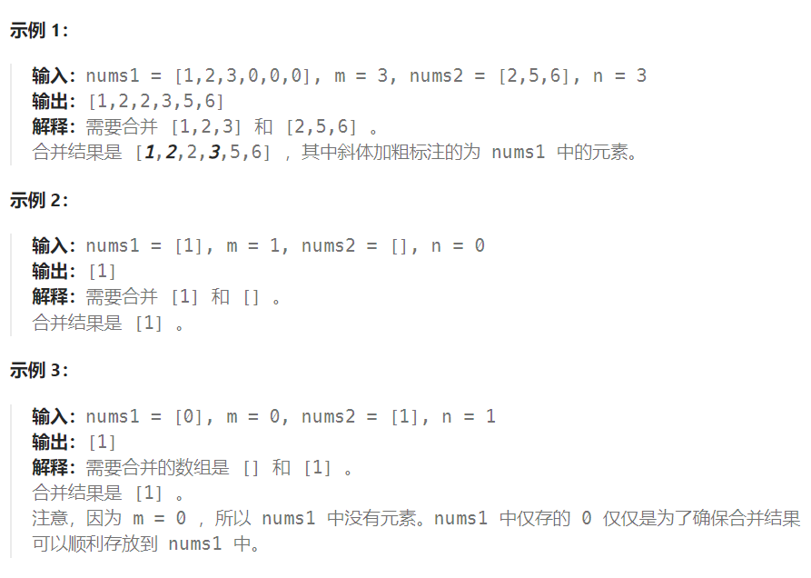

## 题目

给你两个按 **非递减顺序** 排列的整数数组 `nums1` 和 `nums2`，另有两个整数 `m` 和 `n` ，分别表示 `nums1` 和 `nums2` 中的元素数目。

请你 **合并** `nums2` 到 `nums1` 中，使合并后的数组同样按 **非递减顺序** 排列。

**注意：**最终，合并后数组不应由函数返回，而是存储在数组 `nums1` 中。为了应对这种情况，`nums1` 的初始长度为 `m + n`，其中前 `m` 个元素表示应合并的元素，后 `n` 个元素为 `0` ，应忽略。`nums2` 的长度为 `n` 。



## 题解

### 方法一：直接合并后排序

最直观的方法是先将数组 nums2 放进数组 nums1 的尾部，然后直接对整个数组进行排序。

### 方法二：双指针

方法一没有利用数组 nums1 与 nums2 已经被排序的性质。为了利用这一性质，我们可以使用双指针方法。这一方法将两个数组看作队列，每次从两个数组头部取出比较小的数字放到结果中。如下面的动画所示：


我们为两个数组分别设置一个指针 p1 与 p2 来作为队列的头部指针，缺点是必须建立一个长度为 n+m 的临时数组。

### 方法三：逆向双指针

方法二中，之所以要使用临时变量，是因为如果直接合并到数组 nums1 中，nums 中的元素可能会在取出之前被覆盖。那么如何直接避免覆盖 nums1 中的元素呢？观察可知，nums1 的后半部分是空的，可以直接覆盖而不会影响结果。因此可以**指针设置为从后向前遍历，每次取两者之中的较大者放进 nums1 的最后面**。

```go
func merge(nums1 []int, m int, nums2 []int, n int)  {
    index1, index2 := m-1, n-1
    cur := m+n-1
    
    for index1 >= 0 && index2 >= 0 {
        if nums1[index1] >= nums2[index2] {
            nums1[cur] = nums1[index1]
            index1--
        } else {
            nums1[cur] = nums2[index2]
            index2--
        }
        cur--
    }
    for index1 >= 0 {
        nums1[cur] = nums1[index1]
        cur--
        index1--
    }
    for index2 >= 0 {
        nums1[cur] = nums2[index2]
        cur--
        index2--
    }
}
```

