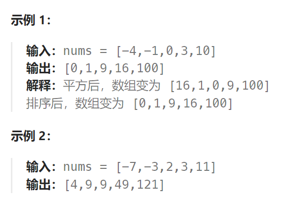

题目：

给你一个按 **非递减顺序** 排序的整数数组 `nums`，返回 **每个数字的平方** 组成的新数组，要求也按 **非递减顺序** 排序。



题解：

数组其实是有序的， 只不过负数平方之后可能成为最大数了。

那么数组平方的最大值就在数组的两端，不是最左边就是最右边，不可能是中间。

此时可以考虑双指针法了，i指向起始位置，j指向终止位置。

定义一个新数组result，和A数组一样的大小，让k指向result数组终止位置。

如果`A[i] * A[i] < A[j] * A[j]` 那么`result[k--] = A[j] * A[j];` 。

如果`A[i] * A[i] >= A[j] * A[j]` 那么`result[k--] = A[i] * A[i];` 。

如动画所示：


```go
func sortedSquares(nums []int) []int {
    res := make([]int, len(nums))

    left, right := 0, len(nums)-1
    resIndex := len(nums)-1

    for left <= right {
        leftV, rightV := nums[left], nums[right]
        if leftV * leftV > rightV * rightV {
            res[resIndex] = leftV * leftV
            left++
        } else {
            res[resIndex] = rightV * rightV
            right--
        }
        resIndex--
    }
    return res
}
```

```java
class Solution {
    public int[] sortedSquares(int[] nums) {
        int[] res = new int[nums.length];
        int resIndex = nums.length - 1;

        int left = 0, right = nums.length - 1;
        while (left <= right) {
            int leftP = nums[left] * nums[left];
            int rightP = nums[right] * nums[right];
            
            if (leftP >= rightP) {
                res[resIndex--] = leftP;
                left++;
            } else {
                res[resIndex--] = rightP;
                right--;
            }
        }
        return res;
    }
}
```

