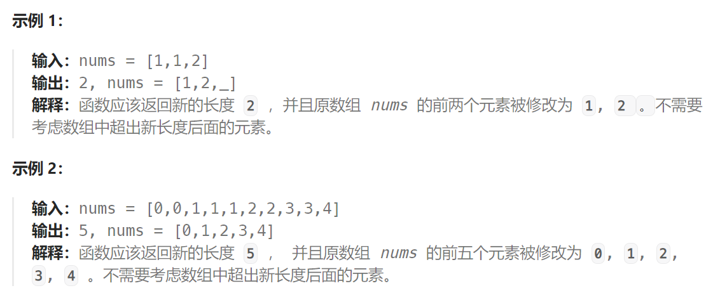

题目：

给你一个 **非严格递增排列** 的数组 `nums` ，请你**[ 原地](http://baike.baidu.com/item/原地算法)** 删除重复出现的元素，使每个元素 **只出现一次** ，返回删除后数组的新长度。元素的 **相对顺序** 应该保持 **一致** 。然后返回 `nums` 中唯一元素的个数。

考虑 `nums` 的唯一元素的数量为 `k` ，你需要做以下事情确保你的题解可以被通过：

- 更改数组 `nums` ，使 `nums` 的前 `k` 个元素包含唯一元素，并按照它们最初在 `nums` 中出现的顺序排列。`nums` 的其余元素与 `nums` 的大小不重要。
- 返回 `k` 。



### 方法一：快慢指针

```go
func removeDuplicates(nums []int) int {
    if len(nums) == 0 {
        return 0
    }
    slow := 0
    for fast := 1; fast < len(nums); fast++ {
        if nums[fast] == nums[slow] {   // 非严格递增数组，相同的元素都紧挨在一起
            continue
        } else {   // 找到第一个与 nums[slow] 不等的元素, 这就是新的唯一元素
            slow++
            nums[slow] = nums[fast] // 前 0~slow 位置来存储 k 个唯一元素
        }
    }
    return slow+1
}
```

### 方法二：优化

考虑如下数组：


此时数组中没有重复元素，按照上面的方法，每次比较时 nums[p] 都不等于 nums[q]，因此就会将 q 指向的元素原地复制一遍，这个操作其实是不必要的。

因此我们可以添加一个小判断，当 q - p > 1 时，才进行复制。

```go
func removeDuplicates(nums []int) int {
    if len(nums) == 0 {
        return 0
    }
    slow := 0
    for fast := 1; fast < len(nums); fast++ {
        if nums[fast] == nums[slow] {   // 非严格递增数组，相同的元素都紧挨在一起
            continue
        } else {   // 找到第一个与 nums[slow] 不等的元素, 这就是新的唯一元素
            slow++
            if fast - (slow) > 0 {   // 额外判断
                nums[slow] = nums[fast] 
            }
        }
    }
    return slow+1
}
```

### 方法三：通用法

```go
func removeDuplicates(nums []int) int {
    if len(nums) <= 1 {
        return len(nums)
    }
    slow := 1   // slow 指向下一个要被替换的位置
    for fast := 1; fast < len(nums); fast++ {
        if nums[slow-1] == nums[fast] {   // 只有fast会向后移动，找到碰到第一个非重复项
            continue
        } else {   // fast 找到了新的非重复项
            nums[slow] = nums[fast] 
            slow++
        }
    }
    return slow   // 0~slow-1 是保存的
}
```

