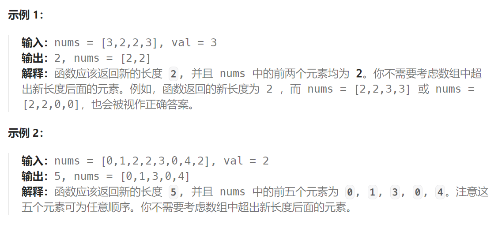

题目：

给你一个数组 `nums` 和一个值 `val`，你需要 **[原地](https://baike.baidu.com/item/原地算法)** 移除所有数值等于 `val` 的元素，并返回移除后数组的新长度。

不要使用额外的数组空间，你必须仅使用 `O(1)` 额外空间并 **[原地 ](https://baike.baidu.com/item/原地算法)修改输入数组**。

元素的顺序可以改变。你不需要考虑数组中超出新长度后面的元素。

**说明:**

为什么返回数值是整数，但输出的答案是数组呢?

请注意，输入数组是以**「引用」**方式传递的，这意味着在函数里修改输入数组对于调用者是可见的。

你可以想象内部操作如下:

```
// nums 是以“引用”方式传递的。也就是说，不对实参作任何拷贝
int len = removeElement(nums, val);

// 在函数里修改输入数组对于调用者是可见的。
// 根据你的函数返回的长度, 它会打印出数组中 该长度范围内 的所有元素。
for (int i = 0; i < len; i++) {
    print(nums[i]);
}
```



题解：

### 方法一：快慢指针

```go
func removeElement(nums []int, val int) int {
    if len(nums) == 0 {
        return 0
    }
    slow := 0
	// 没遇到 val 之前, slow 和 fast 指向同一位置; 
    // 一旦遇到 val, slow 指向第一个出现的val保持不动, 只有 fast 继续向后移动
    // 直到 fast 找到新的 != val 的元素，将其与 slow 进行交换，slow 才向后移动一位
    // 0 ~ slow-1 都是 != val 的值, slow ~ len(nums)-1 都是 == val 的值
    for fast := 0; fast < len(nums); fast++ {
        if nums[fast] != val {   // 找到不等于 val 的元素，将其交换到 nums[] 的前面
            nums[slow] = nums[fast]
            slow++   // 当遇到 == val 的元素时，只有fast向后移动，slow不动
        }
    }
    return slow
}
```

### 方法二：双指针（优化法）

```go
func removeElement(nums []int, val int) int {
    if len(nums) == 0 {
        return 0
    }
    left,right :=0,len(nums) -1
    for {
        if right < left{
            break
        }
        if nums[left] == val{
            nums[left] = nums[right]
            //  left 不变，因为交换过来的 nums[right] 可能也 == val
            right--
        }else{
            left++
        }

    }
    return left 
}
```

