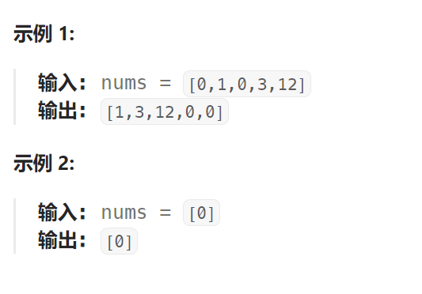
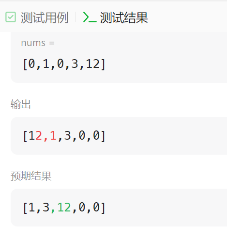

题目：

给定一个数组 `nums`，编写一个函数将所有 `0` 移动到数组的末尾，同时保持非零元素的相对顺序。

**请注意** ，必须在不复制数组的情况下原地对数组进行操作。



题解：

```go
快慢指针
func moveZeroes(nums []int)  {
    n := len(nums)
    slow := 0
    // 当没有遇到 0 的时候, fast与slow同步移动
    // 一旦出现0, slow 将在 0 上停止, 只有 fast 继续移动
    // 当 fast 再次遇到非零元素，会将其与 slow 处的 0 进行交换
    // 实现的效果: 0~slow-1 全部是非零元素, slow ~ fast-1 全部是0
    for fast := 0; fast < n; fast++ {
        if nums[fast] != 0 {
            nums[slow], nums[fast] = nums[fast], nums[slow]
            slow++
        }
    }
}
```

此题不能用双指针法，因为会导致数组非零元素顺序变化：

```go
// 双指针法
func moveZeroes(nums []int)  {
    left, right := 0, len(nums) - 1

    for left <= right {
        if nums[left] == 0 {
            nums[left], nums[right] = nums[right], nums[left]
            right--
        } else {
            left++
        }
    }
}
```

