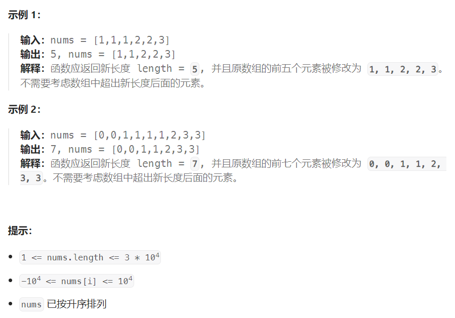

## 题目

给你一个有序数组 `nums` ，请你**[ 原地](http://baike.baidu.com/item/原地算法)** 删除重复出现的元素，使得出现次数超过两次的元素**只出现两次** ，返回删除后数组的新长度。

不要使用额外的数组空间，你必须在 **[原地 ](https://baike.baidu.com/item/原地算法)修改输入数组** 并在使用 O(1) 额外空间的条件下完成。



## 题解

下面给出一直通用的解法，如果每种数值要保留 k 个，只需把下面的 2 改成对应的 k 即可：

```go
func removeDuplicates(nums []int) int {
    if len(nums) <= 2 {
        return len(nums)
    }
    slow := 2   // slow 指向下一个要被替换的位置
    for fast := 2; fast < len(nums); fast++ {
        if nums[slow-2] == nums[fast] {   // 只有fast会向后移动，找到碰到第一个非重复项
            continue
        } else {   // fast 找到了新的非重复项
            nums[slow] = nums[fast] 
            slow++
        }
    }
    return slow   // 0~slow-1 是保留下来的元素值
}
```

