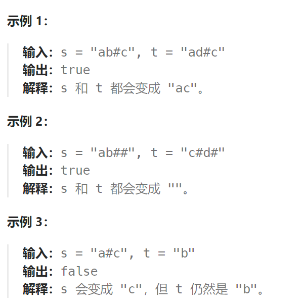

题目：

给定 `s` 和 `t` 两个字符串，当它们分别被输入到空白的文本编辑器后，如果两者相等，返回 `true` 。`#` 代表退格字符。

**注意：**如果对空文本输入退格字符，文本继续为空。



题解：

快慢指针：

```go
func backspaceCompare(s string, t string) bool {
    ss := []byte(s)
    tt := []byte(t)

    return helper(ss) == helper(tt)
}

// 获取重构后的字符串
func helper(chars []byte) string {
    slow := 0

    // 没遇到 '#' 之前，slow 和 fast 保持同步
    // 一旦遇到 '#', slow 就要后移一位，相当于退格符消除掉了前面一个字符
    // 当 fast 再次遇到新的非 '#' 字符，将其与 slow 位置进行交换
    for fast := 0; fast < len(chars); fast++ {
        if chars[fast] != '#' {   // fast 遇到新字符，将其与 slow 位置交换
            chars[slow], chars[fast] = chars[fast], chars[slow]
            slow++
        } else {   // fast 遇到 '#', slow需要退格
            if slow > 0 {
                slow--
            }
        }
    }
    return string(chars[:slow])
}
```

