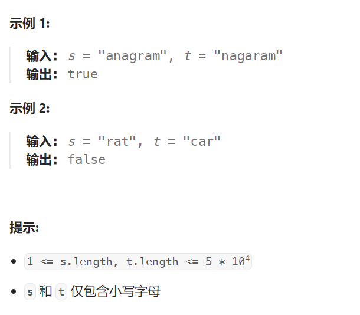

## 题目：

给定两个字符串 `s` 和 `t` ，编写一个函数来判断 `t` 是否是 `s` 的字母异位词。

**注意：**若 `s` 和 `t` 中每个字符出现的次数都相同，则称 `s` 和 `t` 互为字母异位词。



## 题解：

### 方法一：哈希表

```go
func isAnagram(s string, t string) bool {
    tMap := make(map[byte]int)
    for i := 0; i < len(t); i++ {
        tMap[t[i]]++
    }
    for i := 0; i < len(s); i++ {
        count, ok := tMap[s[i]] 
        if !ok {   // s 中含有 t 不存在的字符
            return false
        }
        if count == 0 {   // 该字符在s中出现次数更多
            return false
        }
        tMap[s[i]]--
        if tMap[s[i]] == 0 {
            delete(tMap, s[i])
        }
    }
    if len(tMap) != 0 {
        return false
    } else {
        return true
    }
}
```

### 方法二：数组代替哈希表

**数组其实就是一个简单哈希表**

因为题目中 s 和 t 都是仅由小写字母组成，**取值范围已知且很小**，因此可以用数组代替哈希表。

```go
func isAnagram(s string, t string) bool {
    tSet := make([]int, 26)  // t 仅有26种可能
    for i := 0; i < len(t); i++ {
        index := t[i] - 'a'
        tSet[index]++
    }
    for i := 0; i < len(s); i++ {
        index := s[i] - 'a'
        if tSet[index] == 0 {   // s 中出现了 t 中未出现的字符, 或某字符在s中出现次数更多
            return false
        }
        tSet[index]--
    }
    // tSet 中所有元素都为0
    for i:=0; i < len(tSet); i++ {
        if tSet[i] != 0 {
            return false
        }
    }
    return true
}
```

