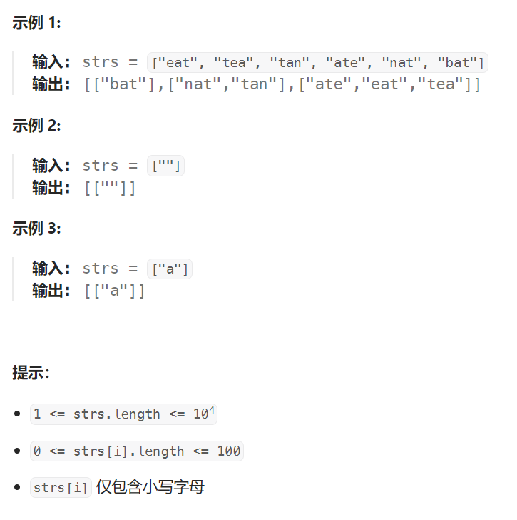

## 题目：

给你一个字符串数组，请你将 **字母异位词** 组合在一起。可以按任意顺序返回结果列表。

**字母异位词** 是由重新排列源单词的所有字母得到的一个新单词。



## 题解：

同一组字母异位词中的字符串具备相同点，可以使用相同点作为一组字母异位词的标志，使用哈希表存储每一组字母异位词，**哈希表的键为一组字母异位词的标志**，**哈希表的值为一组字母异位词列表**。

以下的两种方法分别使用排序和计数作为哈希表的键：

### 方法一：排序

由于互为字母异位词的两个字符串包含的字母相同，因此对两个字符串分别进行排序之后得到的字符串一定是相同的，故可以**将排序之后的字符串作为哈希表的键**。

```go
func groupAnagrams(strs []string) [][]string {
    // 排序后的字符串作为key
    // 字母异构词集合作为value
    countMap := make(map[string][]string)  

    for i:=0; i < len(strs); i++ {
        str := []byte(strs[i])
        sort.Slice(str, func(i, j int) bool {return str[i] < str[j]})
        countMap[string(str)] = append(countMap[string(str)], strs[i])
    }
    res := [][]string{}
    for _,v := range countMap {
        res = append(res, v)
    }
    return res
}
```

### 方法二：计数

由于互为字母异位词的两个字符串包含的字母相同，因此两个字符串中的相同字母出现的次数一定是相同的，故可以**将每个字母出现的次数使用字符串表示，作为哈希表的键**。

由于字符串只包含小写字母，因此对于每个字符串，可以使用长度为 26 的数组记录每个字母出现的次数。

```go
func groupAnagrams(strs []string) [][]string {
    // 记录每个字符串的小写字母出现情况(作为key值)
    // 字母异构词集合作为value
    countMap := make(map[string][]string)  

    for i:=0; i < len(strs); i++ {
        str := strs[i]
        countSet := make([]byte, 26)
        for j := 0; j < len(str); j++ {
            index := str[j] - 'a'
            countSet[index]++  // 统计每个字符串中每个字母的出现次数
        }
        countMap[string(countSet)] = append(countMap[string(countSet)], str)
    }
    res := [][]string{}
    for _,v := range countMap {
        res = append(res, v)
    }
    return res
}
```

