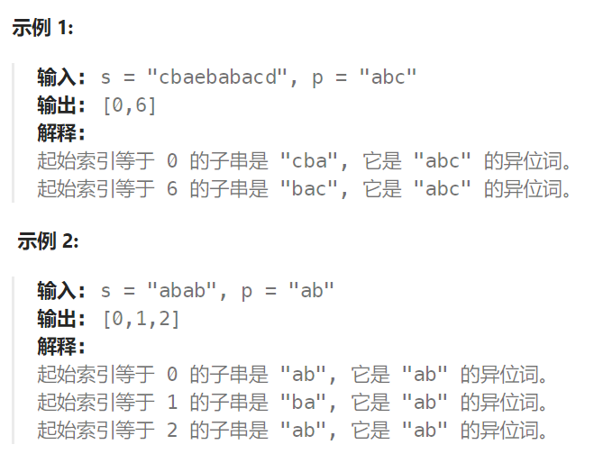

## 题目：

给定两个字符串 `s` 和 `p`，找到 `s` 中所有 `p` 的 **异位词** 的子串，返回这些子串的起始索引。不考虑答案输出的顺序。

**异位词** 指由相同字母重排列形成的字符串（包括相同的字符串）。



## 题解：

### 方法一：根据排序后的字符串进行查询

该方法会超时

```go
import "sort"
func findAnagrams(s string, p string) []int {
    pLen := len(p)
    // 将字符串p排序
    pBytes := []byte(p)
    sort.Slice(pBytes, func(i, j int) bool {return pBytes[i] < pBytes[j]})

    res := []int{}
    for i := 0; i <= len(s)-pLen; i++ {
        // 要进行对比的s的子串,将其进行排序
        sub := []byte(s[i:i+pLen])
        sort.Slice(sub, func(i, j int) bool {return sub[i] < sub[j]})
        // 排序后的结果一致，则该子串是 p 的异位词
        if string(pBytes) == string(sub) {
            res = append(res, i)
        }
    }
    return res
}
```

### 方法二：根据小写字母出现次数进行查询

```go

func findAnagrams(s string, p string) []int {
    pLen := len(p)
    // 1.统计 p 中每个小写字母出现的次数
    pSet := make([]int, 26)
    for i := 0; i < len(p); i++ {
        index := p[i] - 'a'
        pSet[index]++
    }
    res := []int{}
    // 2.查看不同起点的 s 的子串是否是 p 的异位词
    for i := 0; i <= len(s)-pLen; i++ {
        subSet := make([]int, 26)
        // 判断长度为 pLen 的 s 子串是否是 p 的异位词
        for j := i; j < i + pLen; j++ {
            index := s[j] - 'a'
            subSet[index]++
        }
        if equalBytes(pSet, subSet) {
            res = append(res, i)
        }
    }
    return res

}
// 判断两个切片的元素是否都相等
func equalBytes(a, b []int) bool {
    if len(a) != len(b) {
        return false
    }
    for i := 0; i < len(a); i++ {
        if a[i] != b[i] {
            return false
        }
    }
    return true
}
```

