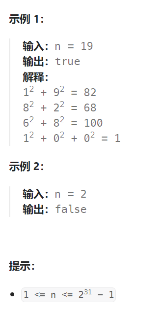
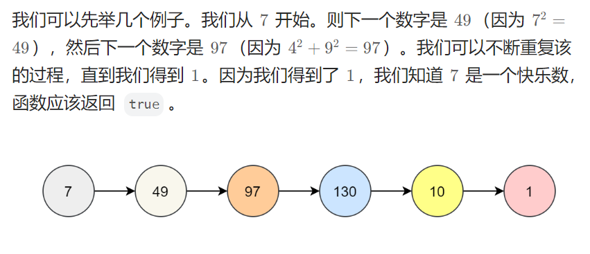
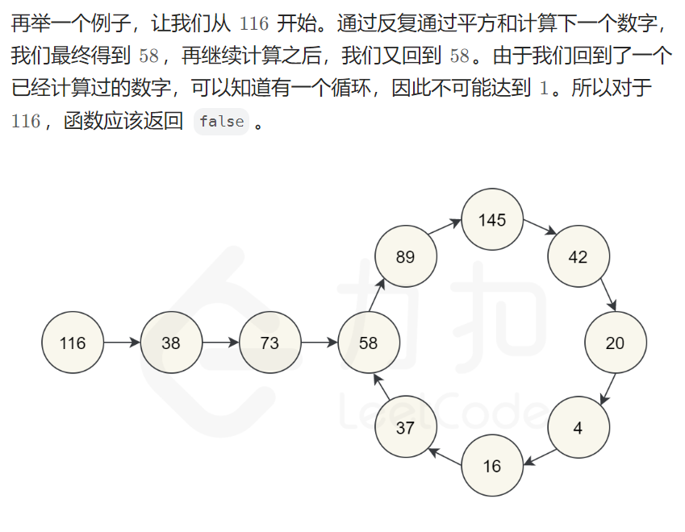
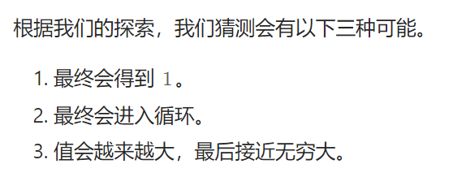

## 题目

编写一个算法来判断一个数 `n` 是不是快乐数。

**「快乐数」** 定义为：

- 对于一个正整数，每一次将该数替换为它每个位置上的数字的平方和。
- 然后重复这个过程直到这个数变为 1，也可能是 **无限循环** 但始终变不到 1。
- 如果这个过程 **结果为** 1，那么这个数就是快乐数。

如果 `n` 是 快乐数 就返回 `true` ；不是，则返回 `false` 。



## 题解







第三个情况比较难以检测和处理。我们怎么知道它会继续变大，而不是最终得到 1 呢？我们可以仔细想一想，每一位数的最大数字的下一位数是多少。

| 位数 |    最大值     | 最大数的分解平方和 |
| ---- | :-----------: | :----------------: |
| 1    |       9       |         81         |
| 2    |      99       |        162         |
| 3    |      999      |        243         |
| 4    |     9999      |        324         |
| 13   | 9999999999999 |        1053        |

从上表可知，无论 n 是多大的数，其经过分解后的平方和不会一直增大，而是减小后区域一个稳定值。例如：对于 3 位数的数字，它不可能大于 243 。这意味着它要么被困在 243 以下的循环内，要么跌到 1 。4 位或 4 位以上的数字在每一步都会丢失一位，直到降到 3 位为止。所以我们知道，最坏的情况下，算法可能会在 243 以下的所有数字上循环，然后回到它已经到过的一个循环或者回到 1 。但它**不会无限期地进行下去，所以我们排除第三种选择。**

```go
func isHappy(n int) bool {
    m := make(map[int]bool)  // 记录某个平方和是否已经出现过
    cur := n   // 表示要拆解的数字
    for {
        if m[cur] {  // 要拆解的数字出现过，说明进入了循环
            return false
        } else {
            m[cur] = true
        }
        // 对 cur 进行拆解, 求平方和
        sum := 0   // 保存拆解数字的平方和
        for {
            lowNum := (cur % 10)
            sum += lowNum * lowNum
            cur = cur / 10
            if cur == 0 {
                break
            }
        }
        if sum == 1 {
            return true
        } else {   // 平方和的结果 != 1, 继续拆解新生成的平方和
            cur = sum
        }
    }
}
```

```java
class Solution {
    public boolean isHappy(int n) {
        Set<Integer> res = new HashSet<>();

        Integer cur = n;

        while(!res.contains(cur) && cur != 1) {
            res.add(cur);

            Integer sum = 0;
            do{
                Integer lower = cur % 10;
                sum += lower * lower;
                cur = cur/10;
            }while(cur != 0);

            cur = sum;
        }
        return cur == 1;
    }
}
```

