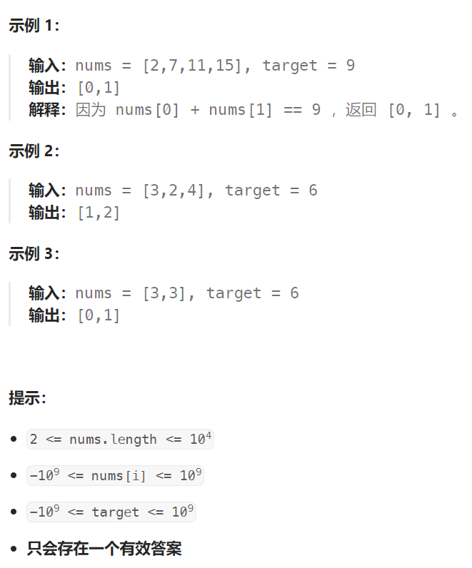

## 题目

给定一个整数数组 `nums` 和一个整数目标值 `target`，请你在该数组中找出 **和为目标值** *`target`* 的那 **两个** 整数，并返回它们的数组下标。

你可以假设每种输入只会对应一个答案。但是，数组中同一个元素在答案里不能重复出现。

你可以按任意顺序返回答案。



## 题解

### 错误解法：

不能直接将所有 nums[i] ~ i 对应关系记录到 hashMap 中，因为在 nums[] 有可能存在重复值

```go
func twoSum(nums []int, target int) []int {
    hashMap := make(map[int]int,0)
    for i := 0; i < len(nums); i++ {
        hashMap[nums[i]] = i
    }

    for val, index1 := range hashMap {
        if index2, ok := hashMap[target - val]; ok {
            if index1 != index2 {
                return []int{index1, index2}
            }
        }
    }
    return nil
}
```

### 正确解法：

```go
func twoSum(nums []int, target int) []int {
    hashMap := make(map[int]int,0)
    for i := 0; i < len(nums); i++ {
        // 先不存 nums[i] ~ i 对应关系, 而是先找 target - nums[i] 是否存在
        // 1. 存在，则直接返回这两个元素的下标
        // 2. 不存在，再将 nums[i] ~ i 对应关系记录到 hashMap 中
        val := nums[i]
        if index, ok := hashMap[target-val];ok {
            return []int{i, index}
        } else {
            hashMap[val] = i
        }
    }
    return nil
}
```

