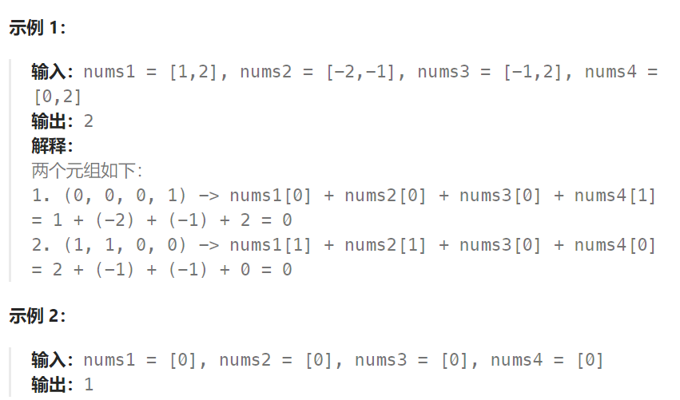
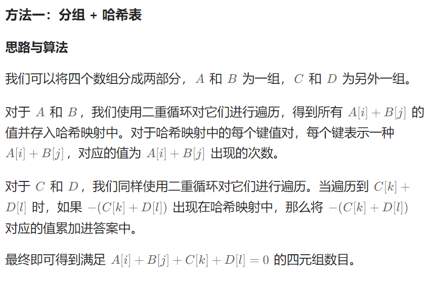

## 题目

给你四个整数数组 `nums1`、`nums2`、`nums3` 和 `nums4` ，数组长度都是 `n` ，请你计算有多少个元组 `(i, j, k, l)` 能满足：

- `0 <= i, j, k, l < n`
- `nums1[i] + nums2[j] + nums3[k] + nums4[l] == 0`



## 题解



### 方法一：

```go
func fourSumCount(nums1 []int, nums2 []int, nums3 []int, nums4 []int) int {
    nums12 := make(map[int]int)  // 统计 nums1 + nums2 每个值的出现次数
    nums34 := make(map[int]int)  // 统计 nums3 + nums4 每个值的出现次数
    for i := 0; i < len(nums1); i++ {
        for j := 0; j < len(nums2); j++ {
            nums12[nums1[i] + nums2[j]]++
        }
    }
    for i := 0; i < len(nums3); i++ {
        for j := 0; j < len(nums4); j++ {
            nums34[nums3[i] + nums4[j]]++
        }
    }
    res := 0
    for sum, c1 := range nums12 {
        if c2,ok := nums34[-sum];ok {
            // 这里是两种组合数的乘积
            // nums1 和 nums2 有 c1 种方法组成 sum
            // nums3 和 nums4 有 c2 种方法组成 -sum
            // 因此四个数组组成0的方式就有 c1*c2 种
            res += c1*c2   
        }
    }
    return res
}
```

### 方法二：（优化版）

```go
func fourSumCount(nums1 []int, nums2 []int, nums3 []int, nums4 []int) int {
    nums12 := make(map[int]int)  // 统计 nums1 + nums2 每个值的出现次数
    // nums34 := make(map[int]int)  // 统计 nums3 + nums4 每个值的出现次数
    for i := 0; i < len(nums1); i++ {
        for j := 0; j < len(nums2); j++ {
            nums12[nums1[i] + nums2[j]]++
        }
    }
    // 总共进行 c2 次 res+= c1
    res := 0
    for i := 0; i < len(nums3); i++ {
        for j := 0; j < len(nums4); j++ {
            res += nums12[-(nums3[i] + nums4[j])]
        }
    }

    return res
}
```

