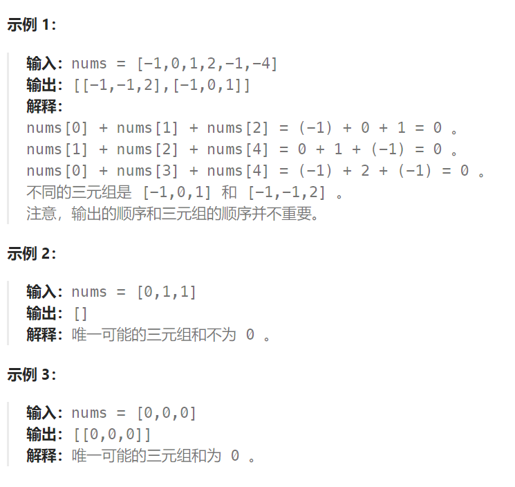

## 题目：

给你一个整数数组 `nums` ，判断是否存在三元组 `[nums[i], nums[j], nums[k]]` 满足 `i != j`、`i != k` 且 `j != k` ，同时还满足 `nums[i] + nums[j] + nums[k] == 0` 。请

你返回所有和为 `0` 且不重复的三元组。

**注意：**答案中不可以包含重复的三元组。



## 题解：

不能仿效两数之和用哈希表解决，因为要求中：数值的组合不能出现重复，这个不好解决。

此题使用 排序 + 双指针 解决。

动画效果如下：


拿这个nums数组来举例，首先将数组排序，然后有一层for循环，i从下标0的地方开始，同时定一个下标left 定义在i+1的位置上，定义下标right 在数组结尾的位置上。

依然还是在数组中找到 abc 使得a + b +c =0，我们这里相当于 a = nums[i]，b = nums[left]，c = nums[right]。

接下来如何移动left 和right呢 ?

1. 如果nums[i] + nums[left] + nums[right] > 0 就说明 此时三数之和大了，因为数组是排序后了，所以right下标就应该向左移动，这样才能让三数之和小一些。

2. 如果 nums[i] + nums[left] + nums[right] < 0 说明 此时 三数之和小了，left 就向右移动，才能让三数之和大一些，直到left与right相遇为止。

过程中注意 fir，sec，thi 这三个数的去重操作。

```go
func threeSum(nums []int) [][]int {
    if len(nums) < 3 {
        return nil
    }
    sort.Ints(nums)

    res := make([][]int, 0)
    // 1.先确定第一个数
    for i := 0; i < len(nums); i++ {
        fir := nums[i]
        if fir > 0 {   // 因为是有序数组，如果第一个数 > 0, 那么三数之和必然大于0
            return res
        }
        // 注意: 防止 fir 重复
        if i > 0 && fir == nums[i-1] { // 以值 fir 作为第一个数的所有可能都已经被 nums[i-1] 列举过了
            continue
        }
        left, right := i+1, len(nums)-1  // 分别指向第二个和第三个数
        for left < right {
            sec, thi := nums[left], nums[right]
            sum := fir + sec + thi
            if sum < 0 {   // 只有第二个数可以增加
                left++
            } else if sum > 0 {  // 只有第三个数可以减小
                right--
            } else {   // 可以加入到结果集
                res = append(res, []int{fir, sec, thi})
                // 将 left 向右移动到第一个 != sec 的位置上  // 注意: 防止 sec 重复
                for nums[left] == sec && left < right {
                    left++
                }
                // 将 right 向左移动到第一个 != thi 的位置上  // 注意: 防止 thi 重复
                for nums[right] == thi && left < right {
                    right--
                }
            }
        }
    }
    return res
}
```

