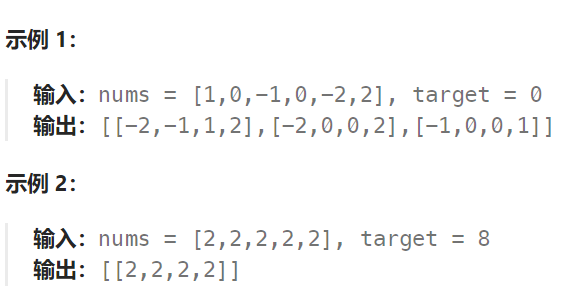

## 题目：

给你一个由 `n` 个整数组成的数组 `nums` ，和一个目标值 `target` 。请你找出并返回满足下述全部条件且**不重复**的四元组 `[nums[a], nums[b], nums[c], nums[d]]` （若两个四元组元素一一对应，则认为两个四元组重复）：

- `0 <= a, b, c, d < n`
- `a`、`b`、`c` 和 `d` **互不相同**
- `nums[a] + nums[b] + nums[c] + nums[d] == target`

你可以按 **任意顺序** 返回答案 。



## 题解：

与三数之和思路一致，只不过多了确定第二个数的过程，同时注意四数之和不再是0，而是指定的 target 

在确定了 fir 之和，需要再确定 sec ，然后再用 双指针 确定 thi 和 fou：

```go
    for i := 0; i < len(nums); i++ {
        fir := nums[i]
        // 注意: 防止 fir 重复
        if i > 0 && fir == nums[i-1] { // 以值 fir 作为第一个数的所有可能都已经被 nums[i-1] 列举过了
            continue
        }
        // 2. 确定第二个数
        sec := 0
        for j := i+1; j < len(nums); j++ {
            sec = nums[j]   // 第二个数已经确定
            
            left, right := j+1, len(nums)-1  // 分别指向第三个和第四个数
           	// ..... 双指针法确定 thi 和 fou
            
            // 注意：防止 sec 重复
            for j < len(nums) && nums[j] == sec {   // 将 sec 移动到一个新的数值上
                j++
            }
            j--  // for 循环会多加一次，因此这里要-1
        }
    }
```


```go
func fourSum(nums []int, target int) [][]int {
    if len(nums) < 3 {
        return nil
    }
    sort.Ints(nums)
    res := make([][]int, 0)
    // 1.先确定第一个数
    for i := 0; i < len(nums); i++ {
        fir := nums[i]
        // 注意: 防止 fir 重复
        if i > 0 && fir == nums[i-1] { // 以值 fir 作为第一个数的所有可能都已经被 nums[i-1] 列举过了
            continue
        }
        // 2. 确定第二个数
        sec := 0
        for j := i+1; j < len(nums); j++ {
            sec = nums[j]   // 第二个数已经确定

            left, right := j+1, len(nums)-1  // 分别指向第三个和第四个数
            for left < right {
                thi, fou := nums[left], nums[right]
                sum := fir + sec + thi + fou
                if sum < target {   // 只有第三个数可以增加
                    left++
                } else if sum > target {  // 只有第四个数可以减小
                    right--
                } else {   // 可以加入到结果集
                    res = append(res, []int{fir, sec, thi, fou})
                    // 将 left 向右移动到第一个 != thi 的位置上  // 注意: 防止 thi 重复
                    for nums[left] == thi && left < right {
                        left++
                    }
                    // 将 right 向左移动到第一个 != fou 的位置上  // 注意: 防止 fou 重复
                    for nums[right] == fou && left < right {
                        right--
                    }
                }
            }
            for j < len(nums) && nums[j] == sec {   // 将 sec 移动到一个新的数值上
                j++
            }
            j--  // for 循环会多加一次，因此这里要-1
        }
    }
    return res
}
```

