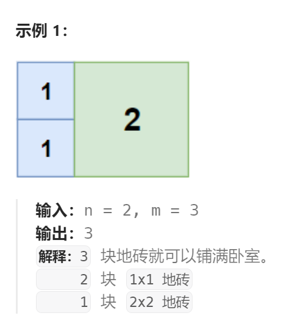
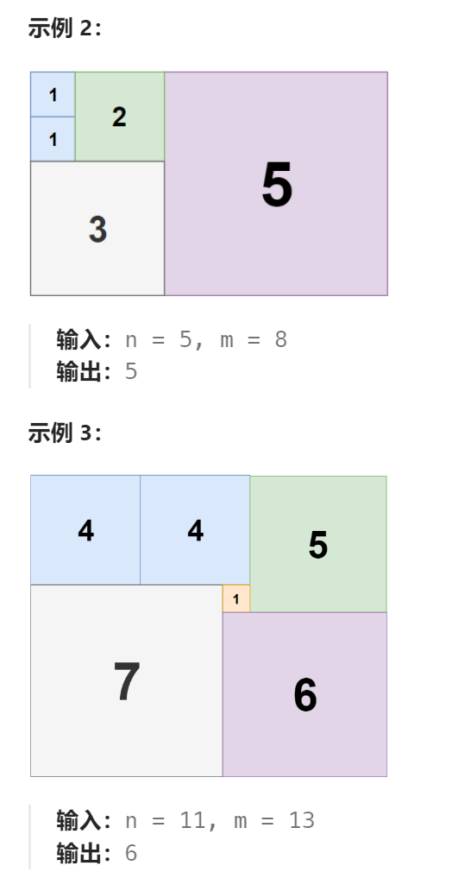
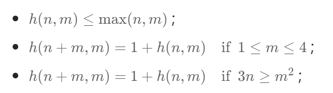

题目：

你是一位施工队的工长，根据设计师的要求准备为一套设计风格独特的房子进行室内装修。

房子的客厅大小为 `n` x `m`，为保持极简的风格，需要使用尽可能少的 **正方形** 瓷砖来铺盖地面。

假设正方形瓷砖的规格不限，边长都是整数。

请你帮设计师计算一下，最少需要用到多少块方形瓷砖？





题解：

**本题不是贪心算法，而需要使用暴力递归。**

本题为一道经典的数学问题，假设 n,m 分别为矩形的长与宽，设 h(m,n) 表示铺满该矩形所需的正方形的最少数目，已有如下结论：



本题为 NP-Complete 问题，没有类似于动态规划的递推公式。具体到本题给定的 n,m 的取值范围为 1≤n≤13,1≤m≤13 ，因此我们可以采用暴力搜索的方法，依次尝试**在空余的格子中铺设正方形**，尝试**遍历所有可能铺设方法**，**找到最少的正方形的数目即可**。我们**用二维矩阵 `rect[n] [m]` 来表示当前长方形中每个点被覆盖的情况**，具体搜索过程如下：

- 初始时，由于长方形的每个点均未被覆盖，矩阵中每个单元格的状态均设置为 false ；

- 从位置 (0,0) 开始依次尝试用正方形来覆盖部分区域，如果当前位置 (x,y) 已经覆盖，则尝试下一个位置 (x,y+1) 。每次尝试从 (x,y) 行正方形覆盖，假设当前覆盖的正方形的左上顶点为 (x,y) ，正方形的长度为 k ，则过程如下：
  - 由于当前覆盖的正方形**不能超越长方形区域的边界**，此时 **k 的取值范围为 1≤k<min⁡(n−x,m−y)** ，为了**减枝**，k 的取值依次**从大到小**进行尝试。
  - 同时需要**检测该正方形区域内是否已被其它正方形覆盖过**，即检测该区域中是否存在 rect[i] [j]=true ，此时 i,j 的取值范围 x≤i<x+k,y≤j<y+k ，如果可以填充则对该正方形区域进行填充，并移动到下一个位置 (x,y+k) 继续尝试搜索；
- 当前如果已经将该矩形进行完全覆盖完成，记录当前最小值并返回。在搜索时同时对当前已经覆盖的正方形进行计数，如果当前计数 cnt 大于等于当前的最小值 ans 时，说明当前的覆盖方法已经不是最优解则直接返回。

```go
func tilingRectangle(n int, m int) int {
    ans := max(n, m)   // 最大需要的砖块数量就是 max(n, m)
    rect := make([][]bool, n)
    for i := 0; i < n; i++ {
        rect[i] = make([]bool, m)
    }

    isAvailable := func(x, y, k int) bool {   // 判断以(x,y)为左上角，边长为k的正方形区域内是否都未被覆盖
        for i := 0; i < k; i++ {
            for j := 0; j < k; j++ {
                if rect[x + i][y + j] {
                    return false
                }
            }
        }
        return true
    }

    fillUp := func(x, y, k int, val bool) { // 将以(x,y)为左上角，边长为k的正方形区域内部都填充上 val
        for i := 0; i < k; i++ {
            for j := 0; j < k; j++ {
                rect[x + i][y + j] = val
            }
        }
    }
    // 一行一行的进行填充
    var dfs func(int, int, int)
    dfs = func(x, y, cnt int) {
        if cnt >= ans {   // 剪枝：已用的瓷砖数不能大于当前最少瓷砖数,否则必定不是最少瓷砖方案
            return
        }
        if x >= n {   // 遍历完所有行(遍历完整个矩阵)，记录新的最少瓷砖数
            ans = cnt
            return
        }
        // 当前行的所有列都被瓷砖覆盖，检测下一行
        if y >= m {
            dfs(x + 1, 0, cnt)
            return
        }
        // 如当前已经被覆盖，则直接尝试下一个位置
        if rect[x][y] {
            dfs(x, y + 1, cnt)
            return
        }

        len := min(n - x, m - y)   // 选择的方形瓷砖的边长，不能使行或列任何一个越界
        // 选择的区域内可能已经有其他瓷砖，因此必须将区域缩小到内部完全未被其他瓷砖覆盖
        for {
            if (len <= 0 || isAvailable(x, y, len)) {  
                break;
            }
            len--  // 一旦有其他瓷砖,就需要缩小当前瓷砖的边长
        }
        for k := len; k >= 1 ; k-- {    // 可选的瓷砖边长在 [1, len] 范围内都可选
            // 将长度为 k 的正方形区域标记覆盖
            fillUp(x, y, k, true)
            // 跳过 k 个位置开始检测
            dfs(x, y + k, cnt + 1)
            // 回溯
            fillUp(x, y, k, false)
        }
    }

    dfs(0, 0, 0)
    return ans
}

func min(a, b int) int {
    if a < b {
        return a
    }
    return b
}

func max(a, b int) int {
    if a > b {
        return a
    }
    return b
}
```

