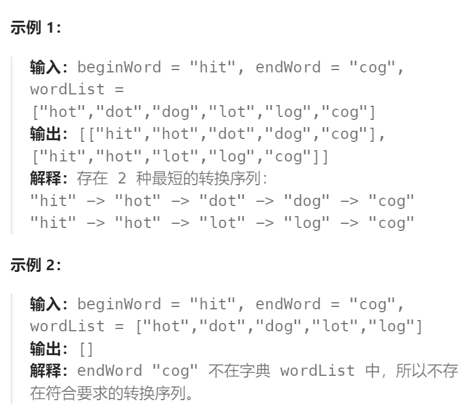

题目：

按字典 `wordList` 完成从单词 `beginWord` 到单词 `endWord` 转化，一个表示此过程的 **转换序列** 是形式上像 `beginWord -> s1 -> s2 -> ... -> sk` 这样的单词序列，并满足：

- 每对相邻的单词之间仅有单个字母不同。
- 转换过程中的每个单词 `si`（`1 <= i <= k`）必须是字典 `wordList` 中的单词。注意，`beginWord` 不必是字典 `wordList` 中的单词。
- `sk == endWord`

给你两个单词 `beginWord` 和 `endWord` ，以及一个字典 `wordList` 。请你找出并返回所有从 `beginWord` 到 `endWord` 的 **最短转换序列** ，如果不存在这样的转换序列，返回一个空列表。每个序列都应该以单词列表 `[beginWord, s1, s2, ..., sk]` 的形式返回。



题解：

1. 本题所求为从`beginWord`到`endWord`的最短路径问题，单词接龙1只需要求出一组就行，单词接龙二需要求出所有的最短路径，那么**求所有的路径，必然用到`dfs`**。**求最短路径必然用到`bfs`**。所以本题是`bfs`和`dfs`的混合题目。

2. `bfs`很简单，求最短路径，但是**`dfs`时，如何进行搜索才能确定是向着最短路径走呢**？ 如果我们从`endWord`开始，进行`bfs`，然后**将每个点到`endWord`的距离求出来**，那么**在执行`dfs`时**，我们可以**在搜索的时候去向距离`endWord`更近的点进行搜索**

```go
//bfs+dfs(如果是双向bfs，效果会更好)
func findLadders(beginWord string, endWord string, wordList []string) [][]string {
    //字典表（将wordList中的单词放入hash表中，方便查找）
    dict:=make(map[string]bool,0)
    for _,v:=range wordList{
        dict[v]=true
    }
    //如果endWord不在hash表中，表示不存在转换列表，返回空集合
    if !dict[endWord]{
        return [][]string{}
    }
    //将第一个单词放入hash表中，方便实现邻接表（构建图）
    dict[beginWord]=true
    //构建邻接表
    graph:=make(map[string][]string,0)
    //执行bfs搜索，找到每个点到endWord的距离
    distance:=bfs(endWord,dict,graph)
    res:=make([][]string,0)//保存结果
    //执行dfs操作
    dfs(beginWord,endWord,&res,[]string{},distance,graph)
    return res
}

// 回溯实现
func dfs(beginWord string,endWord string,res *[][]string,path []string,distance map[string]int,graph map[string][]string){
    //出递归条件
    if beginWord==endWord{
        path=append(path,endWord) //加入endWord节点
        tmp:=make([]string,len(path))
        copy(tmp,path)
        (*res)=append((*res),tmp)
        path=path[:len(path)-1] //移除endWord节点
        return
    }
    //否则遍历图
    for _,v:=range graph[beginWord]{
        //遍历图时，朝着距离与终点越来越近的方向进行（对于最短路，当前节点的距离肯定要比下一个距离正好大1）
        if distance[beginWord]==distance[v]+1{
            path=append(path,beginWord)
            dfs(v,endWord,res,path,distance,graph)
            //回溯（执行完上述的所有时，将其回溯回去）
            path=path[:len(path)-1]
        } 
    }
}

//从终点出发，进行bfs，计算每一个点到达终点的距离
func bfs(endWord string,dict map[string]bool,graph map[string][]string)map[string]int{
    distance:=make(map[string]int,0) //每个点到终点的距离
    queue:=make([]string,0)
    queue=append(queue,endWord)   // 从endWord开始,一步步向beginWord计算，每次距离+1
    distance[endWord]=0 // endWord自己距离自己的 distance == 0
    for len(queue)!=0{
        cursize:=len(queue)
        for i:=0;i<cursize;i++{   // 一次性弹出所有当前距离endWord同一距离的单词。构造graph和distance
            word:=queue[0]
            queue=queue[1:]
            //找到和word有一位不同的单词列表
            expansion:=expand(word,dict)
            for _,v:=range expansion{
                //构造邻接表
                //我们是从beginWord到endWord构造邻接表，而bfs是从endWord开始，所以构造时，反过来构造
                //即graph[v]=append(graph[v],word)而不是graph[word]=append(graph[word],v)
                graph[v]=append(graph[v],word)
                //表示没访问过
                if _,ok:=distance[v];!ok{
                    distance[v]=distance[word]+1 //距离加一
                    queue=append(queue,v) //入队列
                }
            }
        }
    }
    return distance
}

//获得邻接点
func expand(word string,dict map[string]bool)[]string{
    expansion:=make([]string,0) //保存word的邻接点
    //从word的每一位开始
    chs:=[]rune(word) 
    for i:=0;i<len(word);i++{   // 每次确定只有一位不同的邻接点
        tmp:=chs[i] //保存当前位，方便后序进行复位
        for c:='a';c<='z';c++{
            //如果一样则直接跳过，之所以用tmp，是因为chs[i]在变
            if tmp==c{ 
                continue
            }
            chs[i]=c
            newstr:=string(chs)
            //新单词在dict中不存在，则跳过
            if dict[newstr]{
                expansion=append(expansion,newstr)
            }
        }
        chs[i]=tmp //单词位复位
    }
    return expansion
}
```


   