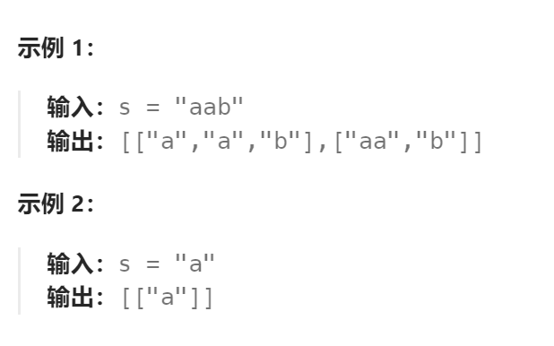

题目：

给你一个字符串 `s`，请你将 `s` 分割成一些子串，使每个子串都是 **回文串** 。返回 `s` 所有可能的分割方案。

**回文串** 是正着读和反着读都一样的字符串。




题解：

**方法一：回溯**

解题方法见`93.复原IP地址`

**方法二：记忆化+回溯**

每次递归都需要重新判断当前子字符串是否是回文字符串是没有必要的。这里我们做了重复的计算，有的子串已经判断过是否回文了，就别再判断了。

做法是用一个memo二维数组，将计算过的子问题结果存下来，下次再遇到就直接拿出来用。

```go
func partition(s string) [][]string {
    res := [][]string{}
    curPath := []string{}

    // (x,y)分别表示子字符串的起点和终点。0 代表未计算 1代表是回文 2 代表不是回文
    memo := make([][]int, len(s))   // 起点x最多有(0~len(s)-1种选择)
    for i := range memo {
        memo[i] = make([]int, len(s))   // 终点y最多有(0~len(s)-1种选择)
    }

    var dfs func(int)
    dfs = func(sStart int) {
        if sStart == len(s) {
            res = append(res, append([]string(nil), curPath...))
            return
        }
        for sEnd := sStart; sEnd < len(s); sEnd++ {
            if memo[sStart][sEnd] == 2 {  // 不是回文,跳过
                continue
            }
            if memo[sStart][sEnd] == 1 || huiwen(s, sStart, sEnd, &memo) {   // 是回文或者还没验证过
                curPath = append(curPath, s[sStart:sEnd+1])   // 记录这个回文字符串
                dfs(sEnd+1)
                // 回溯
                curPath = curPath[:len(curPath)-1]
            }
        }
    }
    dfs(0)
    return res
}

func huiwen(s string ,sStart,sEnd int, memo *[][]int) bool {
    head := sStart
    tail := sEnd

    for {
        if head >= tail {
            (*memo)[sStart][sEnd] = 1
            return true
        }
        if s[head] != s[tail] {
            (*memo)[sStart][sEnd] = 2
            return false
        }
        head++
        tail--
    }
}
```

**方法三：动态规划+回溯**

**先通过动态规划计算出`dp[start][end]`，可以用来判断从` s[start][end]`是否是回文字符串。**

定义 `dp` 子问题：`dp[i][j]`：从 i 到 j 的子串是否回文。

`dp[i][j]`为真的话，包含以下情况：

- i == j时，子串只有一个字符，肯定回文
- j-i == 1时，子串由两个字符组成，字符必须相同s[i] == s[j]
- j-i > 1时，子串由两个以上字符组成，s[i] == s[j]，且`dp[i+1] [j-1]`=true即除去首尾字符的剩余子串也是回文子串。

i 必须小于 j，字符子串的起点必须要小于终点。

1、2 是 base case，即下图的蓝、粉格子，不需要递推出来，3 是状态转移方程（每一个`dp[i][j]`依赖于自己左下角的`dp[i+1][j-1]`）。


```go
func partition(s string) [][]string {
	res := [][]string{}
    curPath := []string{}
	dp := make([][]bool, len(s))
	for i := range dp {
		dp[i] = make([]bool, len(s))
	}
	for j := 0; j < len(s); j++ {    // 从左向右，从上向下
		for i := 0; i <= j; i++ {   // i表示的字符串的左侧，j表示字符串右侧。因此i不可能大于j
			if i == j {
				dp[i][j] = true
			} else if j-i == 1 && s[i] == s[j] {
				dp[i][j] = true
			} else if j-i > 1 && s[i] == s[j] && dp[i+1][j-1] {
				dp[i][j] = true
			}
		}
	}

    var dfs func(int)
    dfs = func(sStart int) {
        if sStart == len(s) {
            res = append(res, append([]string(nil), curPath...))
            return
        }
        for sEnd := sStart; sEnd < len(s); sEnd++ {
            if dp[sStart][sEnd] {   // 是回文或者还没验证过
                curPath = append(curPath, s[sStart:sEnd+1])   // 记录这个回文字符串
                dfs(sEnd+1)
                // 回溯
                curPath = curPath[:len(curPath)-1]
            }
        }
    }
    dfs(0)
	return res
}
```

