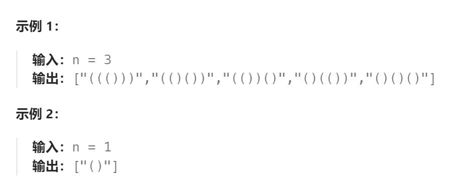

题目：

数字 `n` 代表生成括号的对数，请你设计一个函数，用于能够生成所有可能的并且 **有效的** 括号组合。



题解：

关键点：

- 左括号的数目不能超过 n
- 右括号的数目要时刻小于左括号数目

```go
func generateParenthesis(n int) []string {

    res := []string{}

    left := 0  // 左括号的数量
    right := 0  // 右括号的数量

    var dfs func(string)

    dfs = func(curStr string) {
        if len(curStr) == 2*n {
            res = append(res,curStr)
            return
        }

        if left < n {
            curStr += "("
            left++
            dfs(curStr)
            // 回溯
            left--
            curStr = curStr[:len(curStr)-1]
        }
        if right < left {
            curStr += ")"
            right++
            dfs(curStr)
            // 回溯
            right--
            curStr = curStr[:len(curStr)-1]
        }
    }

    dfs("")

    return res
}
```
