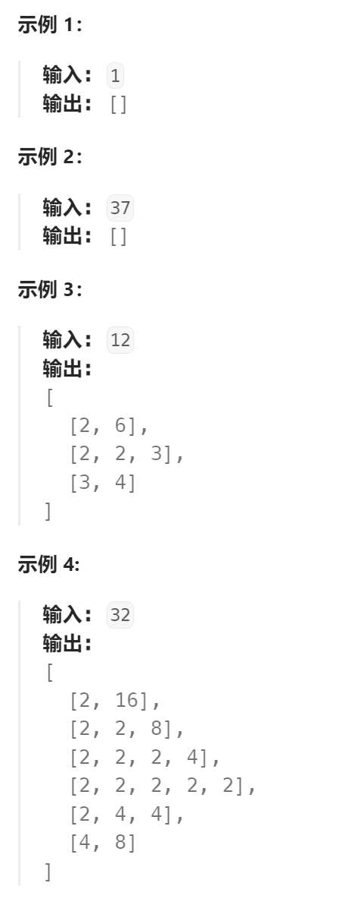

题目：

整数可以被看作是其因子的乘积。

例如：

```
8 = 2 x 2 x 2;
  = 2 x 4.
```

请实现一个函数，该函数接收一个整数 *n* 并返回该整数所有的因子组合。

**注意：**

1. 你可以假定 *n* 为永远为正数。
2. 因子必须大于 1 并且小于 *n*。



题解： 

- 为了防止重复的因子组合：
  - 每一个因子组合都必须是升序的，一个因子只有当其比上一个追加的因子要大(或者等于)的时候才会被追加到因子组合
  - 对于12，因子组合[2,6]和[6,2] 或者 [3,4] 和 [4,3] 都只代表一个因子组合，其中另一个是没有必要花费时间拆解的。因此对于每一个n，第一个因子只能找位于  2 ~ sqrt(n) 范围内的。
- 假如n = 12，当前第一个因子为2，那么此时分为两条路线：
  - 直接将 [2,6] 作为因子组合，做完后回溯
  - 将6作为新的n，继续进行递归，做完后回溯

```go
func getFactors(n int) [][]int {
    result := make([][]int, 0)
    curPath := []int{}

    var dfs func()
    dfs = func() {
        factorSet := make([]int, 0)
        for factor:=2; factor<=int(math.Sqrt(float64(n))); factor++ {  // n的所有位于 2 ~ sqrt(n) 内的因子
            if n%factor == 0 {
                factorSet = append(factorSet, factor)
            }
        }
        if len(factorSet) == 0 {
            return
        }
        for _,factor := range factorSet {
            if len(curPath) > 0 && curPath[len(curPath)-1] > factor {   // factor必须大于等于之前的因子(形成正序)
                continue
            }
            // 追加一对因子( factor 和 n/factor )
            curPath = append(curPath, factor, n/factor)
            result = append(result, append([]int(nil), curPath...))
            // 回溯
            curPath = curPath[:len(curPath)-2]
            // 向下递归, 只追加 fator , n/factor作为新的n
            curPath = append(curPath, factor)
            n = n/factor
            dfs()
            // 回溯
            n = n*factor
            curPath = curPath[:len(curPath)-1]
        }
    }

    dfs()
    return result
}

```

