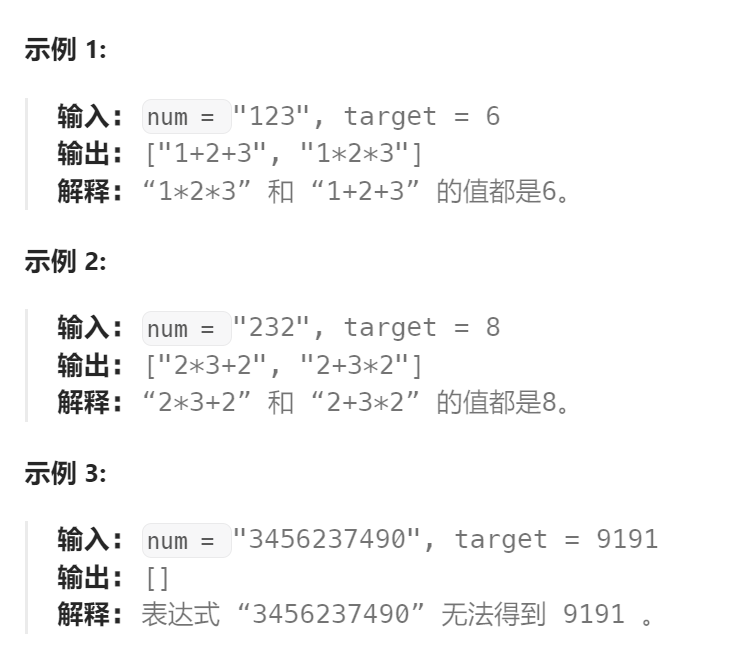
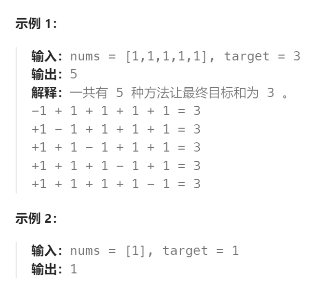

题目：

给定一个仅包含数字 `0-9` 的字符串 `num` 和一个目标值整数 `target` ，在 `num` 的数字之间添加 **二元** 运算符（不是一元）`+`、`-` 或 `*` ，返回 **所有** 能够得到 `target `的表达式。

注意，返回表达式中的操作数 **不应该** 包含前导零。



题解：

从左向右构建表达式，并**实时计算表达式的结果**。由于乘法运算优先级高于加法和减法运算，我们还需要**保存最后一个连乘串（如 `2*3*4 `）的运算结果**。

定义递归函数 `backtrack(expr,i,res,mul)`，其中：

- `exp` 为当前构建出的表达式；
- `i `表示当前的枚举到了 `num` 的第 `i `个数字；
- `res` 为当前表达式的计算结果；
- `mul` 为表达式最后一个连乘串的计算结果。

该递归函数分为两种情况：

- 如果 `i=n` ，说明表达式已经构造完成，若此时有 `res == target`，则找到了一个可行解，我们将 `expr` 放入答案数组中，递归结束；

- 如果` i<n`，需要**枚举当前表达式末尾要添加的符号**（`+`号、`-` 号或 `*` 号），以及**该符号之后需要截取多少位数字**。设该符号之后的数字为 `val`，按符号分类讨论：
  - 若添加 `+` 号，则 `res` 增加 `val`，且 `val` 单独组成表达式**最后一个连乘串**；
  - 若添加 `-`号，则 `res` 减少` val`，且 `−val`单独组成表达式**最后一个连乘串**；
  - 若添加 `*` 号，由于乘法运算优先级高于加法和减法运算，我们需要对 `res` **撤销之前 `mul` 的计算结果**，并**添加新的连乘结果 `mul∗val`**，也就是**将` res` 减少 `mul` 并增加` mul∗val`**。

```go
import "strconv"
func addOperators(num string, target int) (ans []string) {

    expr := make([]byte, 0, len(num)*2-1)

    var backtrack func( int, int,  int)
    backtrack = func(index, res, mul int) {
        if index == len(num) {
            if res == target {
                ans = append(ans, string(expr))
            }
            return
        }
		// 在当前表达式的最后添加一个占位符，留给运算符使用
        signIndex := len(expr)
        if index > 0 {
            expr = append(expr, 0) // 占位，下面填充符号
        }
        // 枚举截取的数字长度（取多少位），注意数字可以是单个 0 但不能有前导零
        val := 0
        for end := index ; end < len(num) ; end++ {
            val = val*10 + int(num[end]-'0')
            // 判断 num[index] ~ index[end] 组成的数字是否有前导零
            factLen := len(strconv.Itoa(val))
            if factLen != (end - index + 1)  {
                break
            }
            // 新添加的因子是: num[index] ~ index[end]
            expr = append(expr, num[index:end+1]...)
            if index == 0 { // 表达式开头不能添加符号
                backtrack(end+1, val, val)    // 此时传入的 sum == 0  mul == 0  下一轮的sum和mul都应该是当前val
            } else { // 枚举符号
                expr[signIndex] = '+'
                backtrack(end+1, res+val, val)
                
                expr[signIndex] = '-'
                backtrack(end+1, res-val, -val)
                
                expr[signIndex] = '*'
                backtrack(end+1, res-mul+mul*val, mul*val)
            }
            // 回溯因子
            expr = expr[:len(expr)-(end-index+1)]
        }
        if index > 0 {   // 回溯符号位
            expr = expr[:len(expr)-1]
        }
    }
    backtrack(0, 0, 0)
    return
}
```


### 类似题目

**题目：494.目标和**

给你一个非负整数数组 `nums` 和一个整数 `target` 。

向数组中的每个整数前添加 `'+'` 或 `'-'` ，然后串联起所有整数，可以构造一个 **表达式** ：

- 例如，`nums = [2, 1]` ，可以在 `2` 之前添加 `'+'` ，在 `1` 之前添加 `'-'` ，然后串联起来得到表达式 `"+2-1"` 。

返回可以通过上述方法构造的、运算结果等于 `target` 的不同 **表达式** 的数目。



题解：

```go
func findTargetSumWays(nums []int, target int) int {
    res := 0
    var backtrack func(int, int)
    backtrack = func(index int, sum int) {
        if index == len(nums) {   // 当前已经遍历完 num
            if sum == target {
                res++
            }
            return
        }
        // 为当前位选择符号，'+' 或者 '-'
        curNum := 0 - nums[index]
        backtrack(index+1, sum + curNum)

        curNum = 0 + nums[index]
        backtrack(index+1, sum + curNum)
    }
    backtrack(0, 0)
    return res
}
```

