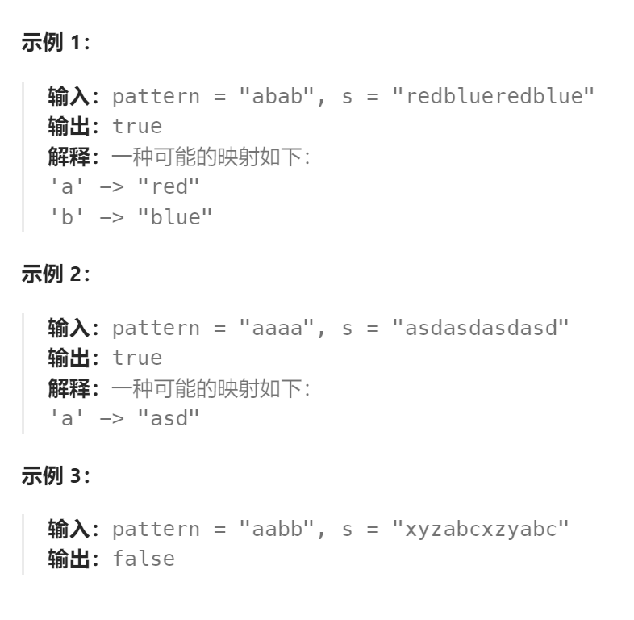

题目：

给你一种规律 `pattern` 和一个字符串 `s`，请你判断 `s` 是否和 `pattern` 的规律**相匹配**。

如果存在单个字符到 **非空** 字符串的 **双射映射** ，那么字符串 `s` 匹配 `pattern` ，即：如果 `pattern` 中的每个字符都被它映射到的字符串替换，那么最终的字符串则为 `s` 。**双射** 意味着映射双方一一对应，不会存在两个字符映射到同一个字符串，也不会存在一个字符分别映射到两个不同的字符串。



题解：

- 每次递归对`pattern`的一位字符进行匹配即可，因此**递归函数中只对`str`进行循环分类递归**
- 如果已经存在映射关系，那么复用之前字符的映射关系。如果复用后发现当前可以成功匹配那么继续递归；如果复用失败，即 同一pattern子串无法获得相同的映射结果，则意味着映射失败。
- 如果不存在映射关系，那么需要新建映射。需要注意：str中同一个映射结果不能被pattern的一子串重复使用。

```go
func wordPatternMatch(pattern string, s string) bool {

    hashMap := make(map[byte]string)   // 记录映射关系(key是pattern[pStart]单字符，value为s的子字符串)
    sHas := make(map[string]bool)  // 在s中此字符串已经被pattern中某个字符串映射过了

    var dfs func(int, int) bool
    dfs = func(pStart, sStart int) bool {
        if pStart == len(pattern) && sStart == len(s) {  // 两个字符串同时完成遍历
            return true 
        } else if pStart == len(pattern) {   //只有pattern完成了遍历
            return false
        } else if sStart == len(s) {   // 只有s完成了遍历
            return false
        }
        mapping, exist := hashMap[pattern[pStart]]
        if exist {   // 已经存在映射关系
            if len(mapping) > len(s) - sStart {   // s剩余长度不足以完成映射
                return false
            }
            target := string(s[sStart:sStart + len(mapping)]) 
            if mapping == target  {  // 能够继续使用已有的映射关系
                return dfs(pStart+1, sStart + len(mapping))
            } else {    // 同一pattern子串无法获得相同的映射结果
                return false
            }
        }  
        sStr := []byte{}
        
        for sEnd := sStart; sEnd < len(s); sEnd++ {  // 还不存在映射关系
            sStr = append(sStr, s[sEnd])
            // 不应该使用过长的子字符串去匹配(至少为pattern中其他字符各留一个)
            if len(sStr) > len(s) - (len(pattern) - 1) {   
                return false
            }
            if sHas[string(sStr)] {  // 这个映射已经被使用过了，不能重复使用
                continue
            } else {
                hashMap[pattern[pStart]] = string(sStr)
                sHas[string(sStr)] = true
                if dfs(pStart+1, sEnd+1) {
                    return true
                } else {   // 失败的分支，进行回溯
                    sHas[string(sStr)] = false
                    delete(hashMap, pattern[pStart])
                }
            }
        }
        return false    // 当前pattern[pStart]无论映射为什么，都无法成功，此分支失败，返回false
    }
    return dfs(0, 0)
}
```

