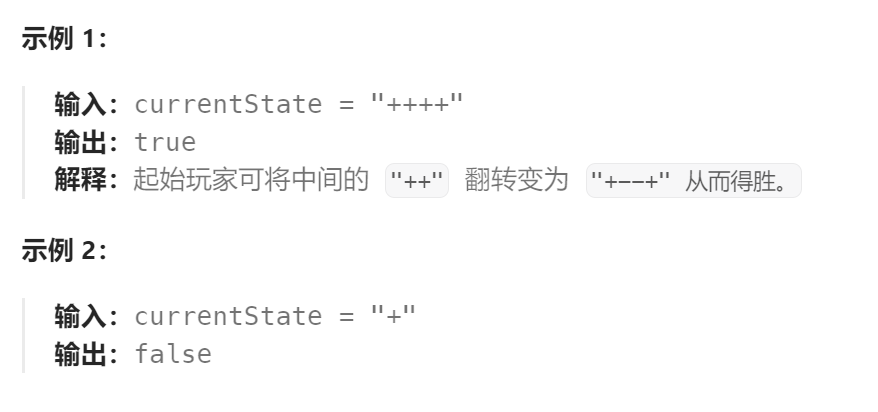

题目：

你和朋友玩一个叫做「翻转游戏」的游戏。游戏规则如下：

给你一个字符串 `currentState` ，其中只含 `'+'` 和 `'-'` 。你和朋友轮流将 **连续** 的两个 `"++"` 反转成 `"--"` 。当一方无法进行有效的翻转时便意味着游戏结束，则另一方获胜。默认每个人都会采取最优策略。

请你写出一个函数来判定起始玩家 **是否存在必胜的方案** ：如果存在，返回 `true` ；否则，返回 `false` 。

 


题解：

```go
func canWin(currentState string) bool {
    return first(currentState)
}

func first(currentState string) bool {
    state := []byte(currentState)
    for start:=0; start<len(state)-1; start++ {
        if state[start] == '+' && state[start+1] == '+' {  // 先手必然优先选择相邻的'+'进行反转
            state[start] = '-'
            state[start+1] = '-'
            if !first(string(state)) {  // 交给后手,后手的失败意味着先手的胜利
                return true
            }
            // 回溯
            state[start] = '+'
            state[start+1] = '+'
        }
    }
    return false
}
```

