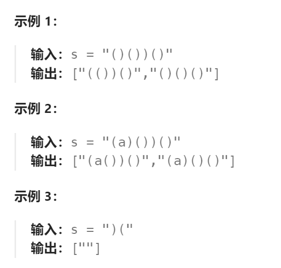

题目：

给你一个由若干括号和字母组成的字符串 `s` ，删除最小数量的无效括号，使得输入的字符串有效。

返回所有可能的结果。答案可以按 **任意顺序** 返回。



题解：

#### 1. 关键点一

对于该题，**要删除的括号的最少数量是确定的**。

利用括号匹配的规则求出该字符串 s  中最少需要去掉的左括号的数目 `lremove`  和右括号的数目 `rremove `

- 当遍历到「左括号」的时候：

  - 「左括号」数量加 1。
- 当遍历到「右括号」的时候：
  - 如果此时「左括号」的数量不为 0 ，因为「右括号」可以与之前遍历到的「左括号」匹配，此时「左括号」出现的次数 −1；
  - 如果此时「左括号」的数量为 0 ，「右括号」数量加 1。
  - 通过这样的计数规则，得到的「左括号」和「右括号」的数量就是各自最少应该删除的数量。

```go
lremove, rremove := 0, 0
for _, ch := range s {
    if ch == '(' {
        lremove++
    } else if ch == ')' {
        if lremove == 0 {
            rremove++
        } else {
            lremove--
        }
    }
}
```

#### 2. 关键点二

尝试在原字符串 s 中去掉 `lremove` 个左括号和 `rremove` 个右括号，然后检测剩余的字符串是否合法匹配，如果合法匹配则我们则认为该字符串为可能的结果，我们利用回溯算法来尝试搜索所有可能的去除括号的方案。

```go
func isValid(str string) bool {
    cnt := 0    // 遇到左括号则++，遇到右括号则--。如果完成遍历时cnt == 0。则字符串合法
    for _, ch := range str {
        if ch == '(' {
            cnt++
        } else if ch == ')' {
            cnt--
            if cnt < 0 {
                return false
            }
        }
    }
    return cnt == 0
}

func helper(ans *[]string, str string, start, lremove, rremove int) {
    if lremove == 0 && rremove == 0 {   // 合法字符串要删除的最少字符个数是固定的，就是lrmv + rrmv
        if isValid(str) {
            *ans = append(*ans, str)
        }
        return
    }
	// 每次都删除一个字符，每个位置上的字符都要尝试一遍
    for i := start; i < len(str); i++ {
        // 去掉重复字符串。当前字符与上一个字符相同, 则去掉上一个字符跟去掉当前字符是一样的结果
        // 与上一个字符相同，而且在上一个字符没有删除的情况下
        // 上一个相同字符不删除，当前这个就不能删（否则在答案解集中会有重复的解）
        // 1.删 删  2.删 不删  3.不删 不删  4.不删 删   情况2和情况4是相同答案
        if i != start && str[i] == str[i-1] {  
            continue
        }
        // 剪枝：如果剩余的字符无法满足去掉的数量要求，直接返回
        if lremove + rremove > len(str)-i {
            return
        }
        // 尝试去掉一个左括号(注意: 变量 i 是不变的，因此删除str[i]后, 新的str[i]就是原本的下一个字符)
        if lremove > 0 && str[i] == '(' {
            helper(ans, str[:i]+str[i+1:], i, lremove-1, rremove)   // start = i
        }
        // 尝试去掉一个右括号(同理，变量 i 是不变的)
        if rremove > 0 && str[i] == ')' {
            helper(ans, str[:i]+str[i+1:], i, lremove, rremove-1)	// start = i
        }
    }
}

func removeInvalidParentheses(s string) (ans []string) {
    lremove, rremove := 0, 0
    for _, ch := range s {
        if ch == '(' {
            lremove++
        } else if ch == ')' {
            if lremove == 0 {
                rremove++
            } else {
                lremove--
            }
        }
    }

    helper(&ans, s, 0, lremove, rremove)
    return
}
```

