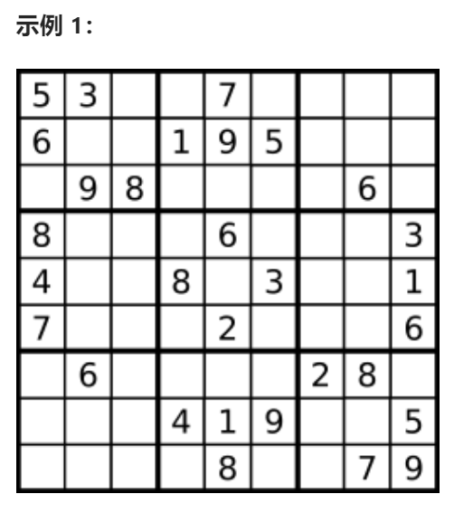
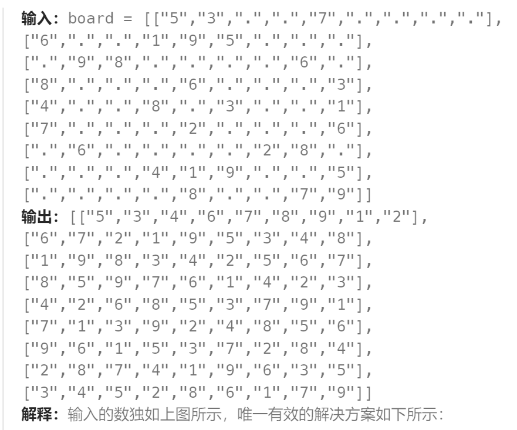
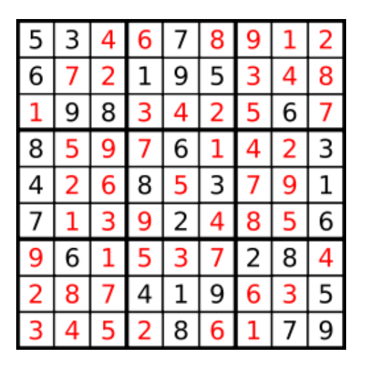

**问题：**

编写一个程序，通过填充空格来解决数独问题。

数独的解法需 **遵循如下规则**：

1. 数字 `1-9` 在每一行只能出现一次。
2. 数字 `1-9` 在每一列只能出现一次。
3. 数字 `1-9` 在每一个以粗实线分隔的 `3x3` 宫内只能出现一次。（请参考示例图）

数独部分空格内已填入了数字，空白格用 `'.'` 表示。

**提示：**

- `board.length == 9`
- `board[i].length == 9`
- `board[i][j]` 是一位数字或者 `'.'`
- 题目数据 **保证** 输入数独仅有一个解








题解：

1. 通过递归 + 回溯的方法枚举所有可能的填法。当递归到最后一个空白格后，如果仍然没有冲突，说明我们找到了答案；在递归的过程中，如果当前的空白格不能填下任何一个数字，那么就进行回溯。
2. 每个数字在同一行、同一列、同一个九宫格中只会出现一次，因此我们可以使用 line[i] ，column[j]，block[x] [y] 分别表示第 i 行，第 j 列，第 (x,y) 个九宫格中填写数字的情况。

> 九宫格的范围为 0≤x≤2  以及 0≤y≤2 。 具体地，第 i 行第 j 列的格子位于第 (⌊i/3⌋,⌊j/3⌋) 个九宫格中，其中 ⌊u⌋ 表示对 u 向上取整。
>

3. 用一个数组记录每个数字是否出现。由于我们可以填写的数字范围为 [1,9]，而数组的下标从 0 开始，因此在存储时，我们使用一个长度为 9 的布尔类型的数组，其中 i 个元素的值为 True ，当且仅当数字 i+1 出现过。例如我们用 line [2] [3]=True 表示数字 4 在第 2 行已经出现过，那么当我们在遍历到第 2 行的空白格时，就不能填入数字 4 。 

```go
func solveSudoku(board [][]byte)  {
    var lineIsSapce,colIsSpace [9][9]bool
    var blockIsSpace [3][3][9]bool
    var spaces [][2]int   // 存储每一个空格的坐标

    // 先遍历一遍整个图，找到所有空格位置的坐标
    for row:=0; row < 9; row++ {
        for col:=0; col < 9; col++ {
            if board[row][col] == '.' {
                spaces = append(spaces,[2]int{row,col})
            } else {
                num := board[row][col] - '1'
                lineIsSapce[row][num] = true
                colIsSpace[col][num] = true
                blockIsSpace[row/3][col/3][num] = true
            }
        }
    }

    var dfs func(int) bool 
    dfs = func(start int) bool {
        if start == len(spaces) {   // 所有的空格都安置了合适的数字
            return true
        }
        space := spaces[start]   // 取出第i个空格位置进行处理
        row,col := space[0],space[1]   // 取出横纵坐标

        for num:=0; num <= 8; num++ {  // 每个空格可选择 1~9 (对应数组下标 0~8 )
            // 选择不能与数独规则冲突(不能发生：行冲突、列冲突、块冲突)
            if !lineIsSapce[row][num] && !colIsSpace[col][num] && !blockIsSpace[row/3][col/3][num] {

                lineIsSapce[row][num] = true
                colIsSpace[col][num] = true
                blockIsSpace[row/3][col/3][num] = true
                board[row][col] = byte(49 + num)   // '1'的ascii码是49
                if dfs(start+1) {    // 得到了一个数独解
                    return true
                }

                lineIsSapce[row][num] = false
                colIsSpace[col][num] = false
                blockIsSpace[row/3][col/3][num] = false
            }
        }
        return false   // 当前空格位置填充任何数都得不到数独解
    }
    dfs(0)
}
```

