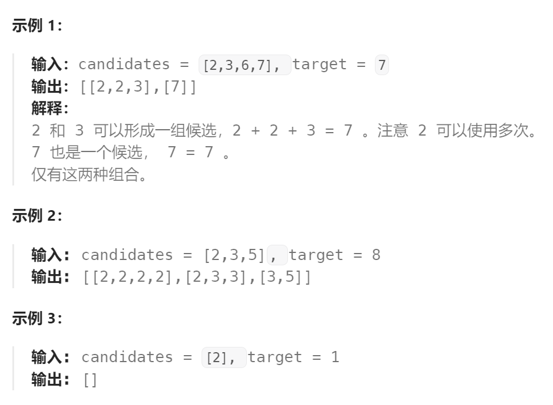

问题：

给你一个 **无重复元素** 的整数数组 `candidates` 和一个目标整数 `target` ，找出 `candidates` 中可以使数字和为目标数 `target` 的 所有 **不同组合** ，并以列表形式返回。你可以按 **任意顺序** 返回这些组合。

`candidates` 中的 **同一个** 数字可以 **无限制重复被选取** 。如果至少一个数字的被选数量不同，则两种组合是不同的。 

对于给定的输入，保证和为 `target` 的不同组合数少于 `150` 个。




题解：

方法一：每次遍历出一个数字的所有出现次数的可能路线

```go
func combinationSum(candidates []int, target int) (ans [][]int) {
		combination := []int{}

		var dfs func(int) 

		dfs = func(index int) {
			if target == 0 {
				ans = append(ans, append([]int(nil), combination...))
				return
			}
			if index == len(candidates) {
				return
			}

			curNum := candidates[index]
			for i:=0; curNum*i <= target; i++ {   // 当前数字可以重复选择
				target -= curNum * i
				for j:=0; j<i; j++ {
					combination = append(combination,curNum)
				}
				dfs(index+1)
				// 回溯
				target += curNum*i
				combination = combination[:len(combination)-i]
			}
		}

		dfs(0)

		return
}
```

方法二：利用一个index作为访问`candidates` 的下标

```go
func combinationSum(candidates []int, target int) (ans [][]int) {
	comb := []int{}    // 所有路线共用, 因此必须采用回溯法(当前路线不会对其他路线产生影响)
	var dfs func(target, idx int)
	dfs = func(target, idx int) {
		if idx == len(candidates) {
			return
		}
		if target == 0 {
			ans = append(ans, append([]int(nil), comb...))
			return
		}
		// 直接跳过(不选择该数)
		dfs(target, idx+1)
		// 选择当前数(idx不变，因为同一个数可以选择多次)
		if target-candidates[idx] >= 0 {
			comb = append(comb, candidates[idx])
			dfs(target-candidates[idx], idx)
			comb = comb[:len(comb)-1]
		}
	}
	dfs(target, 0)
	return
}
```

