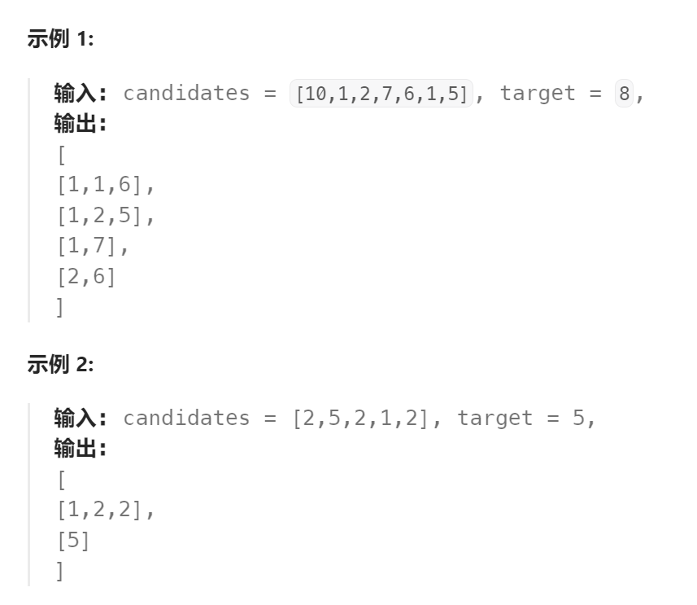

题目：

给定一个候选人编号的集合 `candidates` 和一个目标数 `target` ，找出 `candidates` 中所有可以使数字和为 `target` 的组合。

`candidates` 中的每个数字在每个组合中只能使用 **一次** 。

**注意：**解集不能包含重复的组合。 



题解：

套用`39.组合总和`相同的解法，只不过：

- 创建一个哈希表`numMap`，记录每一种数值出现的次数
- 创建一个新数组`singleSet`，记录不重复出现的所有数字
- 暴力递归中每种数值的出现次数统计，上限有两个：1.`target >= curNum*i`  2.`i<= numMap[curNum]`  2是相对于题目`39`新增的

```go
func combinationSum2(candidates []int, target int) [][]int {
    if len(candidates) == 0 {
        return nil
    }

    res := [][]int{}
    curSet := []int{}

    numMap := make(map[int]int)   // 统计每个数字出现的次数
    for i:=0; i<len(candidates); i++ {
        numMap[candidates[i]]++
    }
    singleSet := make([]int,0)   // 存储不重复的数字
    for single,_ := range numMap {
        singleSet = append(singleSet, single)
    }

    var dfs func(int) 

    dfs = func(index int)  {
        if target == 0 {
            // append([]int(nil), curSet...)的作用是创建新的切片.
            // 保存成功的curSet的副本(不能直接使用curSet,因此后边会在递归中被改动)
            res = append(res, append([]int(nil), curSet...))   
            return
        }
        if len(singleSet) == index {
            return
        }
        curNum := singleSet[index]
        // 同一个数值的数字最多出现的次数在 numMap 中有记录
        for i:=0; i<= numMap[curNum] && target >= curNum*i; i++ {   
            target -= curNum*i
            for j:=0 ; j < i; j++ {
                curSet = append(curSet, curNum)
            }
            dfs(index+1)
            // 回溯
            target += curNum*i
            curSet = curSet[:len(curSet)-i]
        }
       
    }

    dfs(0)

    return res
}
```

