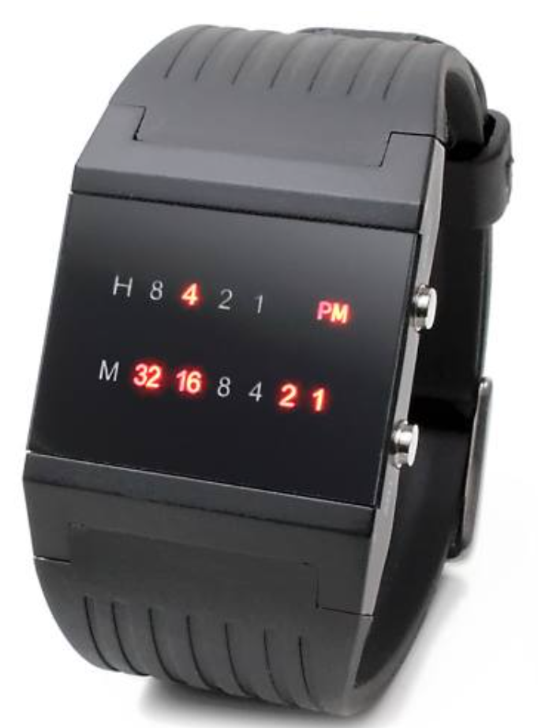
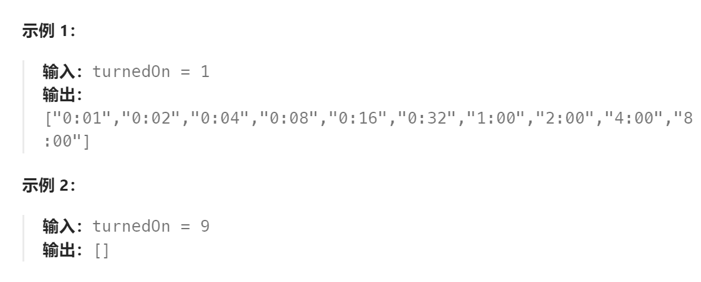

题目：

二进制手表顶部有 4 个 LED 代表 **小时（0-11）**，底部的 6 个 LED 代表 **分钟（0-59）**。每个 LED 代表一个 0 或 1，最低位在右侧。

- 例如，下面的二进制手表读取 `"4:51"` 。



给你一个整数 `turnedOn` ，表示当前亮着的 LED 的数量，返回二进制手表可以表示的所有可能时间。你可以 **按任意顺序** 返回答案。

小时不会以零开头：

- 例如，`"01:00"` 是无效的时间，正确的写法应该是 `"1:00"` 。

分钟必须由两位数组成，可能会以零开头：

- 例如，`"10:2"` 是无效的时间，正确的写法应该是 `"10:02"` 。



题解：

#### 方法一：枚举时分

由题意可知，小时由 4 个比特表示，分钟由 6 个比特表示，比特位值为 0 表示灯灭，为 1 表示灯亮。

我们可以枚举小时的所有可能值 [0,11] ，以及分钟的所有可能值 [0,59] ，并计算二者的二进制中 1 的个数之和，若为 `turnedOn` ，则将其加入到答案中。

```go
func readBinaryWatch(turnedOn int) (ans []string) {
    for h := uint8(0); h < 12; h++ {
        for m := uint8(0); m < 60; m++ {
            if bits.OnesCount8(h)+bits.OnesCount8(m) == turnedOn {
                ans = append(ans, fmt.Sprintf("%d:%02d", h, m))
            }
        }
    }
    return
}
```

#### 方法二：二进制枚举

另一种枚举方法是枚举所有  2^10 =1024 种灯的开闭组合，即用一个二进制数表示灯的开闭，其高 4 位为小时，低 6 位为分钟。若小时和分钟的值均在合法范围内，且二进制中 1 的个数为 `turnedOn` ，则将其加入到答案中。

```go
func readBinaryWatch(turnedOn int) (ans []string) {
    for i := 0; i < 1024; i++ {
        h, m := i>>6, i&63 // 用位运算取出高 4 位和低 6 位
        if h < 12 && m < 60 && bits.OnesCount(uint(i)) == turnedOn {
            ans = append(ans, fmt.Sprintf("%d:%02d", h, m))
        }
    }
    return
}
```

#### 方法三：回溯

- 每次递归设置一位bit，共设置10bit。
- 每bit表示一个灯, 高四位是小时, 底6位是分钟。
- bit = 0 表示不点亮当前LED; bit = 1 表示点亮当前LED.

```go
func readBinaryWatch(turnedOn int) (ans []string) {
    if turnedOn >= 9 {   // 占用位数最多的显示时间就是11:59，占用了8bit，因此九个LED灯以上都是非法的
        return
    }
    curWatch := 0
    
    var dfs func(int) 
    dfs = func(bitIndex int) {   // 一共10位(高四位是小时, 底6位是分钟)
        if turnedOn == 0 {   // 使用了指定数量的LED灯
            hour := curWatch >> 6
            minute := curWatch & 63

            if hour < 12 && minute < 60 {   // 是合理的时间
                ans = append(ans, fmt.Sprintf("%d:%02d", hour, minute))
            }
            return
        }
        if bitIndex == 10 {  // 已经遍历完10bit, 但是还没有使用足够的LED灯
            return
        }
        // 当前位设置为0(也就是不点亮LED)
        tmp := curWatch
        curWatch = curWatch & ^(1<<bitIndex)
        dfs(bitIndex + 1)
        // 回溯
        curWatch = tmp
        // 当前位设置为1(点亮LED)
        tmp = curWatch
        curWatch = curWatch | (1<<bitIndex)
        turnedOn--
        dfs(bitIndex + 1)
        // 回溯
        curWatch = tmp
        turnedOn++
    }

    dfs(0)

    return
}
```

