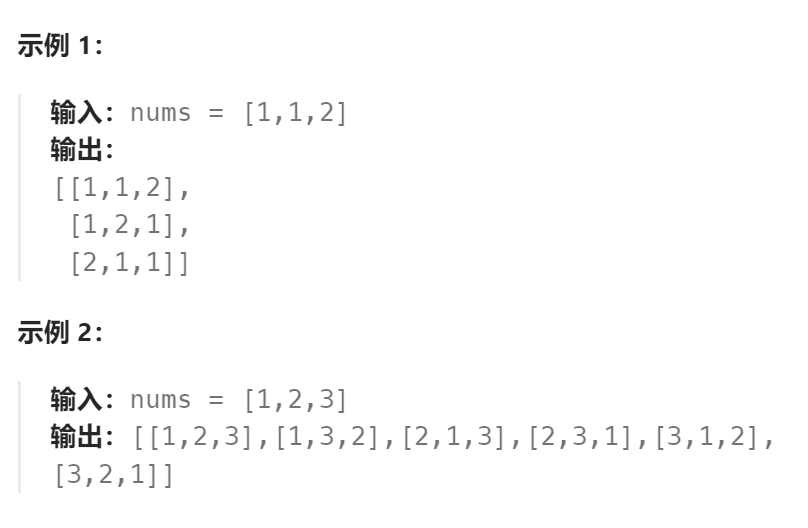

题目：

给定一个**可包含重复数字**的序列 `nums` ，***按任意顺序*** 返回所有不重复的全排列。



题解：

这是典型的排列问题，具有如下特点：

- 输入选集中的所有元素只能在一条确定的结果路径中出现一次，而且从输入选集中选择的元素数量是固定的
- 具有相同数值组合，但是数值顺序不同的结果路径视为两种不一样的结果。
- 输入选集中的数字可能是：1.没有重复数值   2.有重复数值

解题思路：

- 因为所有的结果路径长度是固定的。因此递归结束条件就设置为`len(curPath) == 指定长度`，如果所有元素都要选，那么指定长度就是`len(nums)`
- 与组合问题不一样，组合问题每次递归都是针对输入选集是否选择当前`nums[i]`进行展开。排列问题针对的都是：当前结果路径`curPath[i]`该选择什么，也就是遍历`nums[]`，从中选择一个数字作为当前`curPath[i]`
- `curPath[i]`的选择，对于不同的输入选集具有不同的要求：
  - **`nums[]`中没有重复数值**，那么仅要求**在进行下一次递归时，要跳过已经选择过的`nums[i]`（也就是`curPath[i]`中已经选择过的元素）**，可以通过一个**全局哈希表**进行标记，或直接在**`nums[]`数组中将选过的元素标记为非法值**来实现。**递归完成后要进行回溯。**
  - **`nums[]`中有重复数值**，为了避免在同一位`curPath[i]`（**同一层递归内部**）中选择相同的数值，需要在**每一层递归内部建立一个哈希表**，标记那些已经选过的数值。因为**这个哈希表只存在于每一层递归内部，因此不需要回溯。**

```go
func permuteUnique(nums []int) [][]int {
    res := [][]int{}
    curPath := []int{}

    hasRead := make(map[int]bool)   // 用来记录nums的某一个元素是否已经使用(key为下标)

    var dfs func()

    dfs = func() {
        if len(curPath) == len(nums) {
            res = append(res, append([]int(nil), curPath...))
            return
        }

        // 对于curPath的同一个位置，不能使用nums的不同位置但相同数值的元素(key是num[]的元素值)
        curLoc := make(map[int]bool)   // 仅在当前轮次内有效，下一个递归轮次中要重新初始化

        for i:=0; i<len(nums); i++ {
            if hasRead[i] == true {   // nums中已经使用过的数字不能再重复使用
                continue
            }
            if curLoc[nums[i]] {  // 虽然是没用过的数字,但是其值与已经用过的也相同,那么也不能重复作为curPath[i]
                continue
            } else {
                curLoc[nums[i]] = true
            }
            curNum := nums[i]
            hasRead[i] = true
            curPath = append(curPath, curNum)
            dfs()
            // 回溯
            hasRead[i] = false
            curPath = curPath[:len(curPath)-1]
        }
        
    }
    dfs()
    return res
}
```

