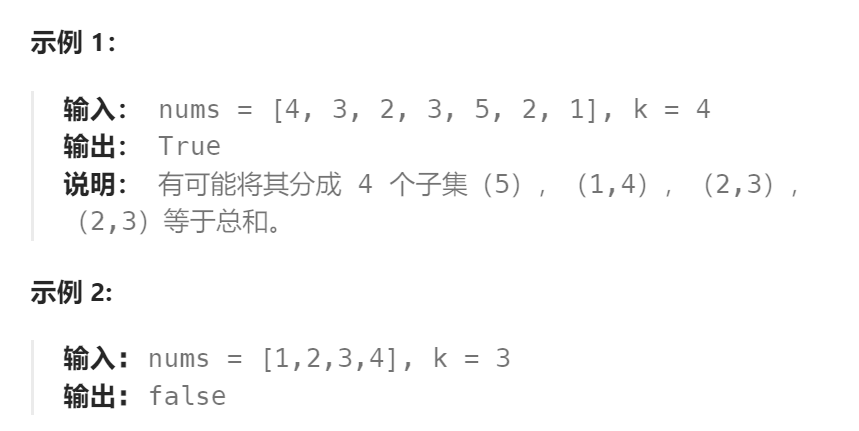

题目：

你将得到一个整数数组 `matchsticks` ，其中 `matchsticks[i]` 是第 `i` 个火柴棒的长度。你要用 **所有的火柴棍** 拼成一个正方形。你 **不能折断** 任何一根火柴棒，但你可以把它们连在一起，而且每根火柴棒必须 **使用一次** 。

如果你能使这个正方形，则返回 `true` ，否则返回 `false` 。


题解：

- 首先计算所有火柴的总长度` totalLen` ，如果 `totalLen` 不是 4 的倍数，那么不可能拼成正方形，返回 false 。
- 当 `totalLen `是 4 的倍数时，每条边的边长为 `len=totalLen/4`，用 `edges `来记录 4 条边已经放入的火柴总长度。
- 题目要求每根火柴都要放置，且每根火柴都有四个可选的放置位置（分别是正方形的四条边）。因此递归函数选择的递归对象就是：当前火柴索引下标 `curStick`
- 当且仅当`edge[i] + matchsticks[curStick] <= totalLen/4`时，当前火柴 `matchsticks[curStick]`才可以放入边`edge[i]`。

```go
func makesquare(matchsticks []int) bool {
    totalLen := 0
    for _, l := range matchsticks {
        totalLen += l
    }
    if totalLen%4 != 0 {
        return false
    }
    avg := totalLen / 4

    sort.Ints(matchsticks) // 减少搜索量

    edges := [4]int{}
    var dfs func(int) bool
    dfs = func(curStick int) bool {   // 每根火柴都有四种放法, 即: 分别放到四条边上
        if curStick == len(matchsticks) {
            if edges[0] == edges[1] && edges[1] == edges[2] && edges[2] == edges[3] && edges[3] == avg {
                return true
            } else {
                return false
            }
        }
        for i:=0; i<4; i++ {
            stick := matchsticks[curStick]
            if edges[i] + stick <= avg {   // 当且仅当当前边小于规定长度时,当前火柴才可以放入
                edges[i] += stick
                if dfs(curStick + 1) {   // 一旦用所有火柴凑齐4条相等的边,即可返回true
                    return true
                }
                // 放入当前边 edges[i]，无法获得4条相等的边，因此回溯
                edges[i] -= stick
            }
        }
        return false  // 当前火柴无论放入哪条边,都不能组成相等的四条边。但题目要求必须使用所有火柴，因此返回false

    }
    return dfs(0)
}
```


## 类似题目：

#### 698. 划分为k个相等的子集

题目：

给定一个整数数组 `nums` 和一个正整数 `k`，找出是否有可能把这个数组分成 `k` 个非空子集，其总和都相等。



题解：

##### 方法一：使用回溯算法 + 剪枝

必须使用剪枝操作，否则会超时。

```go
if i > 0 && set[i] == set[i-1] {
	continue
}
```


```go
func canPartitionKSubsets(nums []int, k int) bool {
    sum := 0
    for _, num := range nums {
        sum += num
    }
    if sum % k != 0 {   // 不能完成k等分, 必然失败
        return false
    }
    avg := sum / k   // 每个子集需要达到的值
    set := make([]int, k)

    var backtrack func(int) bool
    backtrack = func(index int)  bool {
        if index == len(nums) {   // nums[]中所有数字都完成了分配
            // 每个子集的数值都等于avg, 才可以返回true
            for _, val := range set {
                if val != avg {
                    return false
                }
            }
            return true
        }

        for i:=0; i<k; i++ {   // 每个数字 nums[index] 都有k种放置选择
            // 剪枝操作：一旦当前容器已经与上一个容器相等，那么就不必想当前容器set[i]添加nums[index]了
        	if i > 0 && set[i] == set[i-1] {
				continue
			}
            val := nums[index]
            if set[i] + val <= avg {  // 当前子集 set[i] 还未达到最大容量
                set[i] += val
                if backtrack(index+1) {  // 继续放置下一个nums[]数 
                    return true
                }
                set[i] -= val
            }
        }
        return false   // 当前数字 nums[index] 无论放到任何一个 set[i] 容器都无法获得等分的解
    }  

    return backtrack(0)
}
```

