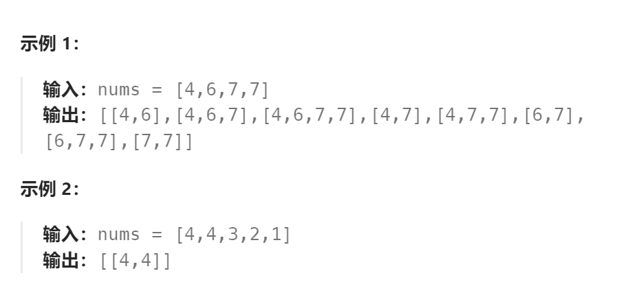

题目：

给你一个整数数组 `nums` ，找出并返回所有该数组中不同的递增子序列，递增子序列中 **至少有两个元素** 。你可以按 **任意顺序** 返回答案。

数组中可能含有重复元素，如出现两个整数相等，也可以视作递增序列的一种特殊情况。



题解：

### 方法一

将不定长度集合枚举问题，分解为若干固定长度集合枚举问题。

**注意：不能用排序打乱原本的顺序**。因此需要额外使用一个 `lastIndex` 作为递归变量。因为 使用`lastIndex`每次不会从头开始遍历 `nums` ，因此不需要将已读元素进行 `map` 记录或者标记为特殊值。

```go
func findSubsequences(nums []int) [][]int {

    res := [][]int{}
    curPath := []int{}

    var backtrack func(int, int ,int)
    backtrack = func(lastVal int, lastIndex int ,length int) {
        if len(curPath) == length {
            res = append(res, append([]int(nil), curPath...))               
            return
        }
        haveSelect := make(map[int]bool)

        // 为当前 curPath[i] 挑选数字
        for i:=lastIndex; i<len(nums); i++ {
            if haveSelect[nums[i]] {   // 当前位已经使用过的nums[i], 不能再次使用
                continue
            }
            // if nums[i] == math.MinInt {
            //    continue
            // }
            if nums[i] < lastVal {   // 必须 >= last
                continue
            }
            curPath = append(curPath, nums[i])
            haveSelect[nums[i]] = true
            backtrack(nums[i], i+1, length)
            curPath = curPath[:len(curPath)-1]
        }

    }

    for i:=2; i<=len(nums); i++ {
        backtrack(math.MinInt, 0, i)
    }

    return res
}
```

### 方法二

每个数字都分为：1.选择    2.不选择   两种情况进行分支递归。

- [不选择]分支设置去重策略：不选择当前数字，当且仅当上一个被选择的数字与当前数字不相等。
- [选择]分支设置合法策略：因为要获取所以得递增子序列，因此：当前仅当当前数字 >= 上一个被选择的数字，才会进行选择。


注：此题目只能在 [不选择] 分支设置去重策略，因为如果在 [选择] 分支设置去重策略，会影响合法策略的正常执行。

```go
func findSubsequences(nums []int) [][]int {

    res := [][]int{}
    curPath := []int{}

    var backtrack func(int, int)
    backtrack = func(index int, last int) {
        // 在不选择分支设置去重策略，那么必须遍历完 nums 的所有元素，不能事先退出
        if index == len(nums) {
            if len(curPath) >=2 {
                res = append(res, append([]int(nil), curPath...))               
            }
            return
        }
        // 不选择当前元素
        if last != nums[index] {
            backtrack(index + 1, last)
        }

        if nums[index] >= last {
            curPath = append(curPath, nums[index])
            backtrack(index+1, nums[index])
            curPath = curPath[:len(curPath)-1]
        }
    }
    backtrack(0, math.MinInt)
    return res
}
```

