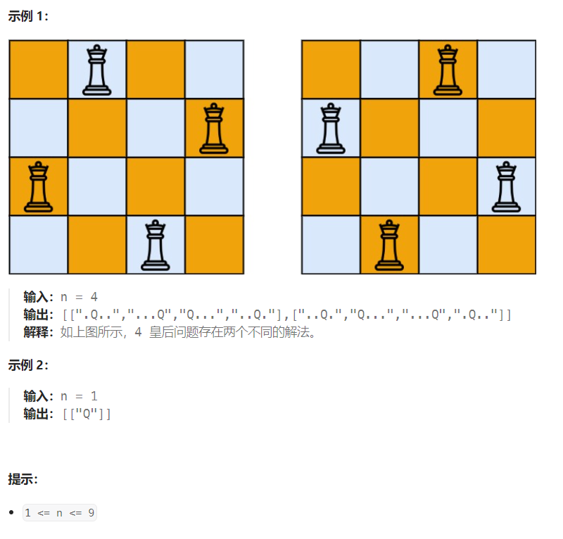

## 题目

按照国际象棋的规则，皇后可以攻击与之处在同一行或同一列或同一斜线上的棋子。

**n 皇后问题** 研究的是如何将 `n` 个皇后放置在 `n×n` 的棋盘上，并且使皇后彼此之间不能相互攻击。

给你一个整数 `n` ，返回所有不同的 **n 皇后问题** 的解决方案。

每一种解法包含一个不同的 **n 皇后问题** 的棋子放置方案，该方案中 `'Q'` 和 `'.'` 分别代表了皇后和空位。



## 题解

```go
func solveNQueens(n int) [][]string {

    // 创建一个空棋盘
    board := make([][]byte, n)
    for i:=0; i<n; i++ {
        board[i] = make([]byte,n)
        for j:=0; j<n; j++ {
            board[i][j] = '.'
        }
    }

    allBoard := [][]string{}
    curBoard := []string{}

    var dfs func(int)

    dfs = func(row int) {
        if row == n {   // 完成棋盘所有行的处理
            allBoard = append(allBoard, append([]string(nil), curBoard...))
            return
        }

        for col:=0; col<n; col++ {  // 为当前行的皇后选择合适的列
           if isValid(board, row, col) {   // 不冲突才可以放置皇后
                board[row][col] = 'Q'
                curBoard = append(curBoard, string(board[row]))
                dfs(row+1)  // 继续处理下一行
                // 回溯
                board[row][col] = '.'
                curBoard = curBoard[:len(curBoard)-1]
           } 
        }
    }

    dfs(0)

    return allBoard
}

// 因为是从上到下的方式进行暴力递归，因此只需要检查 1.上方是否冲突  2.右上是否冲突 3.左上是否冲突
func isValid(board [][]byte, row int, col int) bool {
    n := len(board)
    // 1.不能出现列冲突(不同行在同一列上出现皇后) --> 上(当前row行上面的行)不冲突
    for i:=0; i<row; i++ {
        if board[i][col] == 'Q' {
            return false
        }
    }
    // 2.不能在左上角冲突
    i := row - 1 
    j := col - 1
    for  {
        if i < 0 || j < 0 {
            break
        }
        if board[i][j] == 'Q' {
            return false
        }
        i--
        j--
    }
    // 3.不能在右上角冲突
    i = row - 1
    j = col + 1
    for  {
        if i < 0 || j >= n {
            break
        }

        if board[i][j] == 'Q' {
            return false
        }
        i--
        j++
    }
    return true
}
```

