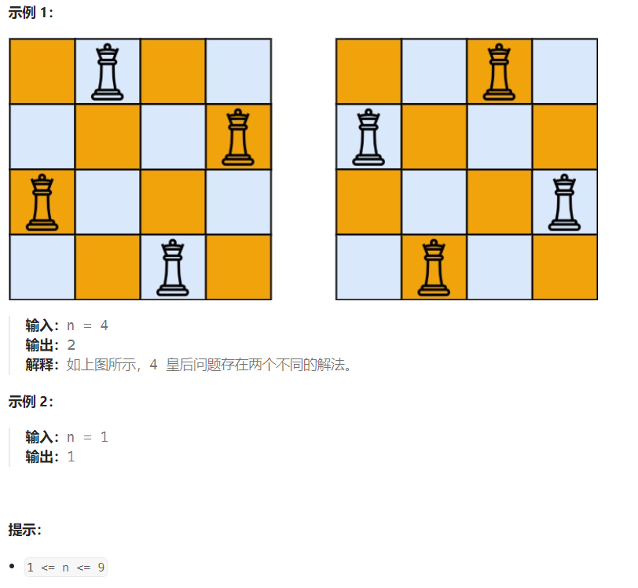

## 题目

**n 皇后问题** 研究的是如何将 `n` 个皇后放置在 `n × n` 的棋盘上，并且使皇后彼此之间不能相互攻击。

给你一个整数 `n` ，返回 **n 皇后问题** 不同的解决方案的数量。



## 题解

```go
func totalNQueens(n int) int {

    // 创建并初始化一个 n*n 棋盘
    board := make([][]byte, n)
    for i:=0; i<n; i++ {
        board[i] = make([]byte, n)
        for j:=0; j<n; j++ {
            board[i][j] = '.'
        }
    }

    solution := 0

    var dfs func(int) 

    dfs = func(row int) {
        if row == n {   // 所有行都被布置皇后，解决方案+1
            solution+=1
            return
        }

        for col:=0; col<n; col++ {
            if isValid(board, row, col) {  // 确保当前行的当前列可以放置皇后
                board[row][col] = 'Q'
                dfs(row+1)
                board[row][col] = '.'
            }
        }

    }

    dfs(0)
    return solution

}

func isValid(board [][]byte, row,col int) bool {
    n := len(board)
    // 0 ~ row-1 行在col列上没有Q
    for i:=0; i<row; i++ {
        if board[i][col] == 'Q' {
            return false
        }
    }
    // 左上对角线上没有Q
    i := row - 1
    j := col - 1
    for {
        if i < 0 || j < 0 {
            break
        }
        if board[i][j] == 'Q' {
            return false
        }
        i--
        j--
    }

    // 右上对角线上没有Q
    i = row - 1
    j = col + 1
    for {
        if i < 0 || j >= n {
            break
        }
        if board[i][j] == 'Q' {
            return false
        }
        i--
        j++     
    }
    return true
}
```

