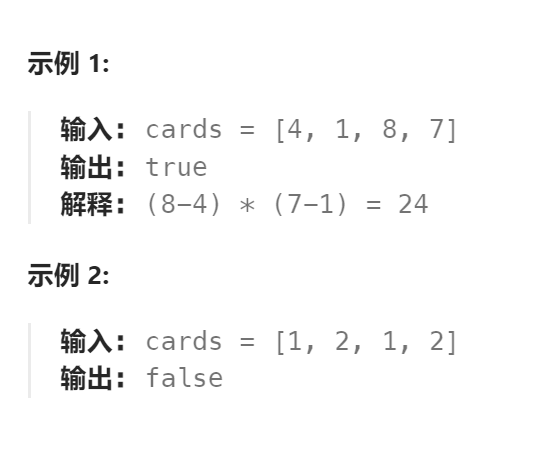

题目：

给定一个长度为4的整数数组 `cards` 。你有 `4` 张卡片，每张卡片上都包含一个范围在 `[1,9]` 的数字。您应该使用运算符 `['+', '-', '*', '/']` 和括号 `'('` 和 `')'` 将这些卡片上的数字排列成数学表达式，以获得值24。

你须遵守以下规则:

- 除法运算符`'/'`表示实数除法，而不是整数除法，因此计算的结果是浮点数
- 每个运算都在两个数字之间。特别是，不能使用`-`作为一元运算符。
  - 例如，如果 `cards =[1,1,1,1]` ，则表达式 `“-1 -1 -1 -1”` 是 **不允许** 的。
- 你不能把数字串在一起
  - 例如，如果 `cards =[1,2,1,2]` ，则表达式 `“12 + 12”` 无效。

如果可以得到这样的表达式，其计算结果为 `24` ，则返回 `true `，否则返回 `false` 。



题解：

一共有 4  个数和 3 个运算操作，因此可能性非常有限。

可以通过回溯的方法遍历所有不同的可能性。具体做法是，使用一个列表存储目前的全部数字，每次从列表中选出 2 个数字，再选择一种运算操作，用计算得到的结果取代选出的 2 个数字，这样列表中的数字就减少了 1 个。重复上述步骤，直到列表中只剩下 1 个数字，这个数字就是一种可能性的结果，如果结果等于 24 ，则说明可以通过运算得到 24 。如果所有的可能性的结果都不等于 24 ，则说明无法通过运算得到 24 。

实现时，有一些细节需要注意。

- 除法运算为实数除法，因此结果为浮点数，列表中存储的数字也都是浮点数。在判断结果是否等于 24 时应考虑精度误差，这道题中，误差小于 10^{-6}，可以认为是相等。

- 进行除法运算时，除数不能为 0 ，如果遇到除数为 0 的情况，则这种可能性可以直接排除。由于列表中存储的数字是浮点数，因此判断除数是否为 0 时应考虑精度误差，这道题中，当一个数字的绝对值小于 10^{-6} 时，可以认为该数字等于 0 。


还有一个可以优化的点。

- 加法和乘法都满足交换律，因此如果选择的运算操作是加法或乘法，则对于选出的 2 个数字不需要考虑不同的顺序，在遇到第二种顺序时可以不进行运算，直接跳过。


```go
const (
    TARGET = 24
    EPSILON = 1e-6
    ADD, MULTIPLY, SUBTRACT, DIVIDE = 0, 1, 2, 3
)

func judgePoint24(nums []int) bool {
    list := []float64{}
    for _, num := range nums {
        list = append(list, float64(num))
    }
    return solve(list)
}

func solve(list []float64) bool {
    if len(list) == 0 {
        return false
    }
    if len(list) == 1 {
        return abs(list[0] - TARGET) < EPSILON
    }
    size := len(list)
    for i := 0; i < size; i++ {   // 选择第一张卡牌的下标
        for j := 0; j < size; j++ {   // 选择第二张卡牌的下标
            if i != j {   // 两次不能选择同一张卡牌
                list2 := []float64{}    // 保存前两张卡牌运算后(运算后算作一张)的剩余卡组
                for k := 0; k < size; k++ {
                    if k != i && k != j {
                        list2 = append(list2, list[k])   // 先将剩余的卡牌追加进来
                    }
                }
                // 四种运算挑一个，算完的结果加到list2里
                for op := 0; op < 4; op++ {
                    // 加法和乘法符合交换律。因此只需计算一次(这里只计算 j+i 和 j*i, 而不计算 i+j 和 i*j)
                    if op < 2 && i < j {
                        continue
                    }
                    switch op {
                    case ADD:
                        list2 = append(list2, list[i] + list[j])
                    case MULTIPLY:
                        list2 = append(list2, list[i] * list[j])
                    case SUBTRACT:
                        list2 = append(list2, list[i] - list[j])
                    case DIVIDE:
                        if abs(list[j]) < EPSILON {    // 除数不能为0, 因为是浮点数, 因此存在一个误差
                            continue
                        } else {
                            list2 = append(list2, list[i] / list[j])
                        }
                    }
                    // 递归计算余下的，直到list中只剩下一个数字，若此数字为24, 则会返回true
                    if solve(list2) {
                        return true
                    }
                    // 计算失败, 进行回溯(重新挑选一种运算方式进行计算)
                    list2 = list2[:len(list2) - 1]
                }
            }
        }
    }
    // 无论当前选择哪两张卡牌,最终都无法得到24。说明上一步的卡牌选择不合理。
    return false
}

func abs(x float64) float64 {
    if x < 0 {
        return -x
    }
    return x
}
```

