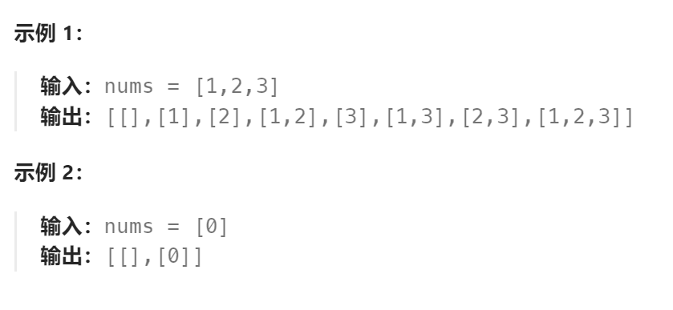

题目：

给你一个整数数组 `nums` ，数组中的元素 **互不相同** 。返回该数组所有可能的子集（幂集）。

解集 **不能** 包含重复的子集。你可以按 **任意顺序** 返回解集。

**提示：**

- `1 <= nums.length <= 10`
- `-10 <= nums[i] <= 10`
- `nums` 中的所有元素 **互不相同**



题解：

**方法一：组合问题标准解法**

- 因为结果路径长度不固定，因此将`nums[i]`作为递归对象，每次递归都将分为： 1.`curPath[]`追加当前`nums[i]` 2.`curPath[]`不追加当前`nums[i]`
- 因为原数组`nums[]`中不存在重复数值，因此在选择追加当前`nums[i]`的递归路径时，不需要额外的考虑
- 为了防止`[1,2]`和`[2,1]`重复结果的出现，需要将`nums[i]`先进行排序。

```go
func subsets(nums []int) [][]int {
    res := [][]int{}
    curPath := []int{}
    sort.Ints(nums)

    var dfs func(int)

    dfs = func(index int) {
        if index == len(nums) {
            res = append(res, append([]int(nil), curPath...))
            return
        }

        // 不选择当前nums[i]
        dfs(index + 1)

        // 选择当前nums[i]
        curPath = append(curPath, nums[index])
        dfs(index+1)
        curPath = curPath[:len(curPath)-1]
    }
    dfs(0)
    return res
}
```


**方法二：**

其实组合问题也可以看作是：多个排列问题的集成。

组合问题的所有结果路径长度是不固定的，但其实我们可以将其划分为具有固定路径长度的排列问题的集成，如下：

```go
for i:=1; i<=len(nums); i++ {   // 指定排列问题结果路径长度
    dfs(nums[0]-1, i)   // 排列求解法，递归对象是 curPath[i]，为其考虑从nums[]选择哪一个值
}
```

```go
func subsets(nums []int) [][]int {
    res := [][]int{}
    res = append(res, []int{})
    if len(nums) == 0 {
        return res
    }
    curPath := []int{}

    var dfs func(int, int)

    dfs = func(lastNum int, length int) {   // lastNum表示上一个使用的nums[]元素,length表示当前子集的长度
        if len(curPath) == length {
            res = append(res, append([]int(nil), curPath...))
            return
        }
        for i:=0; i<len(nums); i++ {
            curNum := nums[i]
            // 为了避免出现重复数字,让curPath维持递增的姿态(当前curPath[i]必须要大于之前的)
            if curNum <= lastNum {   
                continue
            } else {
                curPath = append(curPath, curNum)
                dfs(curNum,length)
                curPath = curPath[:len(curPath)-1]
            }
        }
    }

    sort.Ints(nums)   // 需要对nums数组进行排序
    for i:=1; i<=len(nums); i++ {
        dfs(nums[0]-1, i)   // num[0]-1是一个不存在nums[]中的数值,而且比nums[]中所有数值都要小
    }

    return res
}
```

