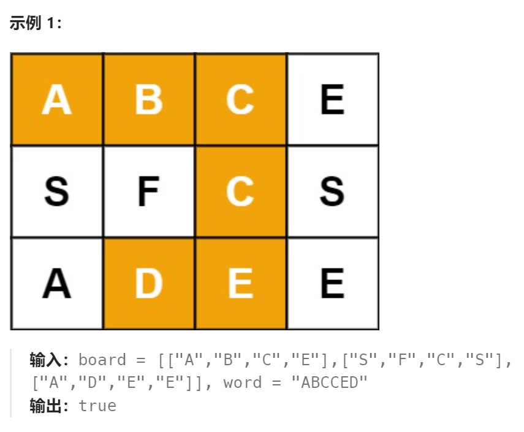

题目：

给定一个 `m x n` 二维字符网格 `board` 和一个字符串单词 `word` 。如果 `word` 存在于网格中，返回 `true` ；否则，返回 `false` 。

单词必须按照字母顺序，通过相邻的单元格内的字母构成，其中“相邻”单元格是那些水平相邻或垂直相邻的单元格。同一个单元格内的字母不允许被重复使用。



题解：

思路分为以下几点：

- 每个单元格都需要作为起点进行尝试
- 每个单元格都有"上/下/左/右"四个方向可以尝试，这将作为四个递归子问题
- 需要考虑递归过程中网格的"越界问题"
- 在递归时，已经走过的格子不能重复走，因此需要一个哈希表或者其他方式标记已经走过的路径的格子

**题解一：**

- 每个格子都会作为起点
- 每次都分为上下左右四个方向进行递归，完成对应方向的递归后进行回溯
- 使用切片`curPath`记录当前已走的路径，时刻将其与`word`进行比较
- 使用哈希表`hasPass`标记已经走过的单元格

```go
func exist(board [][]byte, word string) bool {

    rowMax := len(board)-1
    colMax := len(board[0])-1

    curPath := []byte{}
    curRow := 0
    curCol := 0

    hasPass := make(map[[2]int]bool)   // 记录已经经过的单元格

    maxStep := len(word)
    totalStep := 0

    var dfs func() bool
    dfs = func() bool {   // 策略：从(0,0)开始，每次都分从上向下和从左向右走
        if totalStep > maxStep {
            return false
        }
        if string(curPath) == word {
            return true
        }
        if string(curPath) != word[:len(curPath)] {
            return false
        }
        // 1.向下走
        if curRow < rowMax {
            if !hasPass[[2]int{curRow+1,curCol}] {  // 必须保证下一个格子是没有走过的
                curRow++
                curPath = append(curPath,board[curRow][curCol])
                hasPass[[2]int{curRow,curCol}] = true
                totalStep++
                if dfs() {
                    return true
                }
                hasPass[[2]int{curRow,curCol}] = false
                curRow--
                curPath = curPath[:len(curPath)-1]
                totalStep--
            }
        }
        // 2.向上走
        if curRow > 0 {
            if !hasPass[[2]int{curRow-1,curCol}] {  // 必须保证上一个格子是没有走过的
                curRow--
                curPath = append(curPath,board[curRow][curCol])
                hasPass[[2]int{curRow,curCol}] = true
                totalStep++
                if dfs() {
                    return true
                }
                hasPass[[2]int{curRow,curCol}] = false
                curRow++
                curPath = curPath[:len(curPath)-1]  
                totalStep--
            }
        }       
        // 3.向右走
        if curCol < colMax {
            if !hasPass[[2]int{curRow,curCol+1}] {  // 必须保证右一个格子是没有走过的
                curCol++
                curPath = append(curPath,board[curRow][curCol])
                hasPass[[2]int{curRow,curCol}] = true
                totalStep++
                if dfs() {
                    return true
                }
                hasPass[[2]int{curRow,curCol}] = false
                curCol--
                curPath = curPath[:len(curPath)-1]
                totalStep--
            }
        }
        // 4.向左走
        if curCol > 0 {
            if !hasPass[[2]int{curRow,curCol-1}] {  // 必须保证左一个格子是没有走过的
                curCol--
                curPath = append(curPath,board[curRow][curCol])
                hasPass[[2]int{curRow,curCol}] = true
                totalStep++
                if dfs() {
                    return true
                }
                hasPass[[2]int{curRow,curCol}] = false
                curCol++
                curPath = curPath[:len(curPath)-1]
                totalStep--
            }
        }
        return false
    }

    // 选择起点(每一个点都有做起点的权利)
    for row:=0; row <= rowMax; row++ {
        for col:=0; col <= colMax; col++ {
            curRow = row
            curCol = col
            curPath = append(curPath, board[curRow][curCol])
            hasPass[[2]int{curRow,curCol}] = true
            if dfs() {
                return true
            }
            curPath = curPath[:len(curPath)-1]
            hasPass[[2]int{curRow,curCol}] = false
        }
    }
    return false

}
```

**题解二：**

题解一执行用时很高，主要在于：1.使用哈希表记录走过的格子，每次递归都需要插入和查询，消耗较多时间    2.使用切片记录整个走过的路径，每次递归+回溯都需要改动底层数组，耗时较多。

因此，题解二中不再使用哈希表记录走过的格子，而是直接修改board矩阵：

- 走过的格子直接在`board`中设置为特殊字符`*`，一旦遇到`*`说明该格子已经走过。每次递归完进行回溯时将格子恢复为原来的值

```go
func exist(board [][]byte, word string) bool {

    rowMax := len(board)-1
    colMax := len(board[0])-1

    curPath := []byte{}
    curRow := 0
    curCol := 0

    maxStep := len(word)
    totalStep := 0

    var dfs func() bool
    dfs = func() bool {   // 策略：从(0,0)开始，每次都分从上向下和从左向右走
        if totalStep > maxStep {
            return false
        }
        if string(curPath) == word {
            return true
        }
        if string(curPath) != word[:len(curPath)] {
            return false
        }
        // 1.向下走
        if curRow < rowMax {
            if board[curRow+1][curCol] != '*' {  // 必须保证下一个格子是没有走过的
                curRow++
                curPath = append(curPath,board[curRow][curCol])
                totalStep++
								temp := board[curRow][curCol]
            		board[curRow][curCol] = '*'
                if dfs() {
                    return true
                }
								board[curRow][curCol] = temp
                curRow--
                curPath = curPath[:len(curPath)-1]
                totalStep--
            }
        }
        // 2.向上走
        if curRow > 0 {
            if board[curRow-1][curCol] != '*' {  // 必须保证上一个格子是没有走过的
                curRow--
                curPath = append(curPath,board[curRow][curCol])
                totalStep++
								temp := board[curRow][curCol]
            		board[curRow][curCol] = '*'
                if dfs() {
                    return true
                }
								board[curRow][curCol] = temp									
                curRow++
                curPath = curPath[:len(curPath)-1]  
                totalStep--							
            }
        }       
        // 3.向右走
        if curCol < colMax {
            if board[curRow][curCol+1] != '*' {  // 必须保证右一个格子是没有走过的
                curCol++
                curPath = append(curPath,board[curRow][curCol])
                totalStep++
								temp := board[curRow][curCol]
            		board[curRow][curCol] = '*'								
                if dfs() {
                    return true
                }
								board[curRow][curCol] = temp										
                curCol--
                curPath = curPath[:len(curPath)-1]
                totalStep--
						
            }
        }
        // 4.向左走
        if curCol > 0 {
            if board[curRow][curCol-1] != '*' {  // 必须保证左一个格子是没有走过的
                curCol--
                curPath = append(curPath,board[curRow][curCol])
                totalStep++
								temp := board[curRow][curCol]
            		board[curRow][curCol] = '*'								
                if dfs() {
                    return true
                }
								board[curRow][curCol] = temp										
                curCol++
                curPath = curPath[:len(curPath)-1]
                totalStep--						
            }
        }
        return false
    }

    // 选择起点(每一个点都有做起点的权利)
    for row:=0; row <= rowMax; row++ {
        for col:=0; col <= colMax; col++ {
            curRow = row
            curCol = col
            curPath = append(curPath, board[curRow][curCol])
						temp := board[curRow][curCol]
            board[curRow][curCol] = '*'
            if dfs() {
                return true
            }
            curPath = curPath[:len(curPath)-1]
            board[curRow][curCol] = temp
        }
    }
    return false

}
```

**题解三： ** **（`DFS`+回溯）**

没有必要用一个切片完全记录整个走过的路径，可以每次递归都只将：当前格子字符 与 目标字符串`word`  相应位置处的字符进行比较。

- 新增一个递归变量`k`，用来指示让当前单元格字符与word的word[k]字符进行比较

```go
func exist(board [][]byte, word string) bool {
	found := false
	m, n := len(board), len(board[0])
	var dfs func(i, j, k int)
	dfs = func(i, j, k int) {
		// 超出索引范围
		if i < 0 || j < 0 || i >= m || j >= n {
			return
		}
		// 走过，不能再走
		if board[i][j] == '*' {
			return
		}
		// 元素不相等
		if board[i][j] != word[k] {
			return
		}
		// 元素相等 && 长度相等，标记找到
		if k == len(word)-1 {
			found = true
			return
		}
		// 标记走过
		tmp := board[i][j]
		board[i][j] = '*'

		// 继续往后走
		dfs(i-1, j, k+1)
		dfs(i+1, j, k+1)
		dfs(i, j-1, k+1)
		dfs(i, j+1, k+1)

		// 从 [i,j] 为中心，向四个方向发散走，进行验证
		// 走完之后需回溯状态，以便于下一个点的验证
		board[i][j] = tmp
	}

	for i := 0; i < m; i++ {
		for j := 0; j < n; j++ {
			k := 0 // index of the word
			dfs(i, j, k)
		}
	}
	return found
}
```

